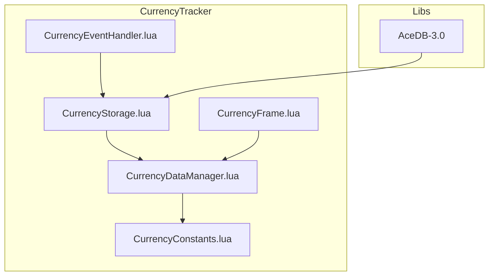
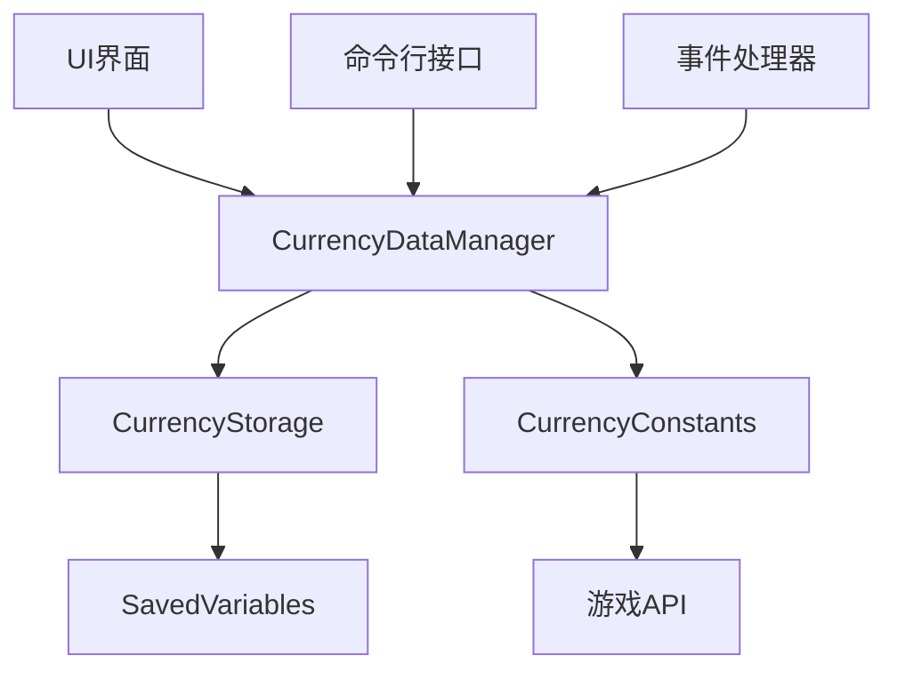
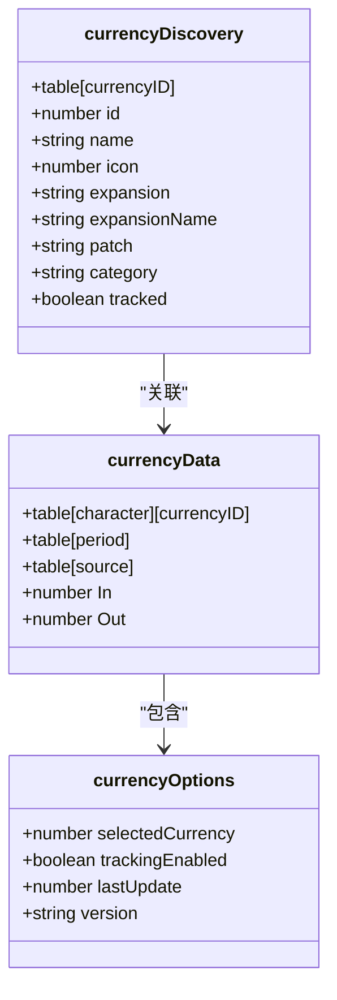
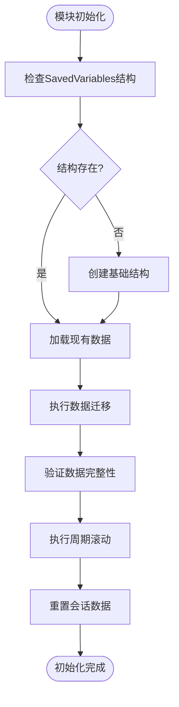
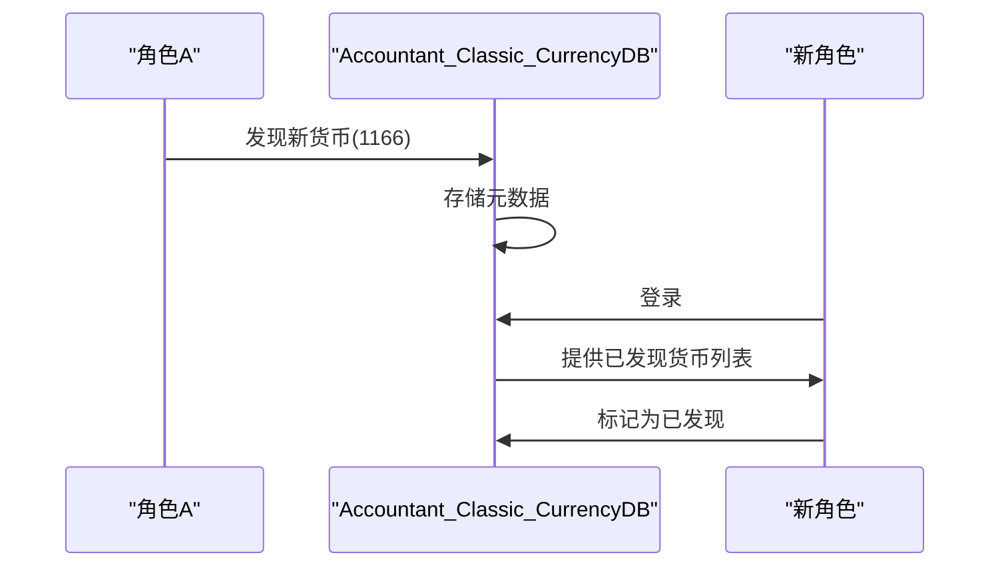
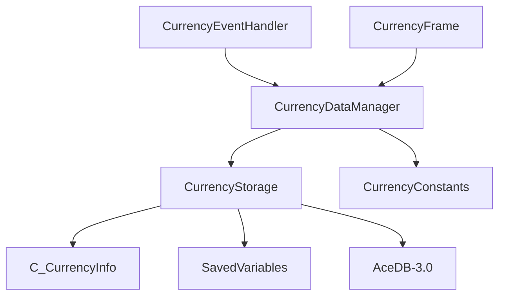

# 数据模型与存储

<cite>
**本文档引用的文件**
- [CurrencyStorage.lua](file://CurrencyTracker/CurrencyStorage.lua)
- [CurrencyDataManager.lua](file://CurrencyTracker/CurrencyDataManager.lua)
- [CurrencyConstants.lua](file://CurrencyTracker/CurrencyConstants.lua)
</cite>

## 目录
1. [简介](#简介)
2. [项目结构](#项目结构)
3. [核心组件](#核心组件)
4. [架构概述](#架构概述)
5. [详细组件分析](#详细组件分析)
6. [依赖分析](#依赖分析)
7. [性能考虑](#性能考虑)
8. [故障排除指南](#故障排除指南)
9. [结论](#结论)
10. [附录](#附录)（如有必要）

## 简介
本文档深入解析Accountant_Classic插件中货币跟踪模块的数据模型设计。重点分析CurrencyStorage.lua中currencyData和currencyDiscovery数据结构的设计原理，阐述CurrencyDataManager.lua如何管理数据的加载、初始化和持久化，以及Accountant_Classic_CurrencyDB在跨角色货币发现信息同步中的作用。文档还提供数据查询接口的使用示例、扩展支持新货币类型的方法，以及数据生命周期管理的最佳实践和性能优化建议。

## 项目结构
货币跟踪模块的代码组织清晰，主要由核心逻辑、数据管理、事件处理和UI组件构成。数据模型和存储逻辑集中在CurrencyTracker目录下，通过模块化设计实现了功能分离。



**图表来源**
- [CurrencyStorage.lua](file://CurrencyTracker/CurrencyStorage.lua#L1-L50)
- [CurrencyDataManager.lua](file://CurrencyTracker/CurrencyDataManager.lua#L1-L50)

**章节来源**
- [CurrencyStorage.lua](file://CurrencyTracker/CurrencyStorage.lua#L1-L100)
- [CurrencyDataManager.lua](file://CurrencyTracker/CurrencyDataManager.lua#L1-L100)

## 核心组件
货币跟踪模块的核心组件包括CurrencyStorage（负责数据持久化）、CurrencyDataManager（提供数据操作接口）和CurrencyConstants（定义货币元数据）。这些组件协同工作，实现对游戏内货币的精确跟踪和管理。

**章节来源**
- [CurrencyStorage.lua](file://CurrencyTracker/CurrencyStorage.lua#L1-L100)
- [CurrencyDataManager.lua](file://CurrencyTracker/CurrencyDataManager.lua#L1-L100)

## 架构概述
系统采用分层架构，上层模块通过清晰的接口调用下层服务。CurrencyDataManager作为业务逻辑层，封装了对CurrencyStorage数据访问层的操作，同时利用CurrencyConstants提供的元数据进行货币信息的丰富和验证。



**图表来源**
- [CurrencyDataManager.lua](file://CurrencyTracker/CurrencyDataManager.lua#L1-L50)
- [CurrencyStorage.lua](file://CurrencyTracker/CurrencyStorage.lua#L1-L50)

## 详细组件分析
本节深入分析货币跟踪模块的关键组件，包括数据结构设计、数据管理流程和跨角色同步机制。

### CurrencyStorage 数据结构分析
CurrencyStorage模块定义了两个核心数据结构：currencyData用于存储货币交易记录，currencyDiscovery用于管理货币发现信息。

#### 数据结构类图


**图表来源**
- [CurrencyStorage.lua](file://CurrencyTracker/CurrencyStorage.lua#L500-L600)

#### currencyData 数据结构
currencyData是角色级别的数据结构，存储在Accountant_ClassicSaveData[server][character].currencyData中。其设计遵循以下原则：

- **字段含义**：
  - `currencyID`：货币的唯一标识符，作为主键
  - `period`：时间周期，包括Session、Day、Week、Month、Year、Total等
  - `source`：交易来源，如"QuestReward"、"Vendor"等
  - `In`：该来源的收入金额
  - `Out`：该来源的支出金额

- **数据类型**：
  - `currencyID`：数字（number）
  - `period`：字符串（string）
  - `source`：字符串（string）
  - `In/Out`：数字（number），非负整数

- **存储范围**：
  - **角色级**：currencyData存储在角色特定的SavedVariables中，每个角色独立维护自己的货币交易记录
  - **账号级**：通过Accountant_Classic_CurrencyDB实现跨角色的货币发现信息同步

**章节来源**
- [CurrencyStorage.lua](file://CurrencyTracker/CurrencyStorage.lua#L500-L700)

#### currencyDiscovery 数据结构
currencyDiscovery用于存储动态发现的货币元数据，其设计特点如下：

- **字段含义**：
  - `id`：货币ID，与currencyData中的currencyID对应
  - `name`：货币名称，从游戏API获取或使用默认值
  - `icon`：货币图标文件ID
  - `expansion`：所属资料片缩写
  - `expansionName`：资料片全称
  - `patch`：引入的补丁版本
  - `category`：货币分类
  - `tracked`：是否启用跟踪

- **数据类型**：
  - 所有字段均为基本类型（数字、字符串、布尔值）

- **存储范围**：
  - **账号级**：存储在全局的Accountant_Classic_CurrencyDB.currencyDiscovery中，实现跨角色共享
  - **角色级**：通过迁移机制将旧的per-character discovery数据合并到全局数据库

**章节来源**
- [CurrencyStorage.lua](file://CurrencyTracker/CurrencyStorage.lua#L500-L600)

### CurrencyDataManager 数据管理分析
CurrencyDataManager模块负责管理货币数据的加载、初始化和持久化，是业务逻辑的核心。

#### 数据管理流程图


**图表来源**
- [CurrencyStorage.lua](file://CurrencyTracker/CurrencyStorage.lua#L400-L500)

#### 数据完整性校验
CurrencyDataManager通过以下机制确保数据完整性：

1. **结构验证**：在初始化时调用EnsureSavedVariablesStructure()确保基础数据结构完整
2. **版本校验**：检查currencyOptions.version，必要时执行数据迁移
3. **数据修复**：提供RepairRemove等接口用于修正异常数据

#### 版本迁移策略
系统采用渐进式版本迁移策略：

1. **版本标识**：在currencyOptions中存储CURRENCY_VERSION
2. **迁移触发**：当检测到旧版本时，调用MigrateData()执行迁移
3. **兼容处理**：MigrateZeroSourceToBaselinePrime()将数字源键0迁移到字符串键"BaselinePrime"

**章节来源**
- [CurrencyStorage.lua](file://CurrencyTracker/CurrencyStorage.lua#L400-L600)
- [CurrencyDataManager.lua](file://CurrencyTracker/CurrencyDataManager.lua#L1-L100)

### Accountant_Classic_CurrencyDB 跨角色同步分析
Accountant_Classic_CurrencyDB是实现跨角色货币发现信息同步的关键组件。

#### 同步机制序列图


**图表来源**
- [CurrencyStorage.lua](file://CurrencyTracker/CurrencyStorage.lua#L500-L600)

该机制通过以下步骤实现：
1. **全局存储**：所有发现的货币信息存储在_G.Accountant_Classic_CurrencyDB.currencyDiscovery
2. **迁移机制**：首次登录时，将角色级的currencyDiscovery数据迁移到全局数据库
3. **去重清理**：迁移完成后，清理旧的角色级数据表

**章节来源**
- [CurrencyStorage.lua](file://CurrencyTracker/CurrencyStorage.lua#L500-L600)

## 依赖分析
货币跟踪模块依赖于多个外部组件和游戏API，形成清晰的依赖关系。



**图表来源**
- [CurrencyDataManager.lua](file://CurrencyTracker/CurrencyDataManager.lua#L1-L50)
- [CurrencyStorage.lua](file://CurrencyTracker/CurrencyStorage.lua#L1-L50)

**章节来源**
- [CurrencyDataManager.lua](file://CurrencyTracker/CurrencyDataManager.lua#L1-L100)
- [CurrencyStorage.lua](file://CurrencyTracker/CurrencyStorage.lua#L1-L100)

## 性能考虑
系统在设计时充分考虑了性能因素，采取了多项优化措施：

1. **轻量级存储**：仅存储必要的交易摘要数据，避免保存每笔交易的详细记录
2. **延迟初始化**：模块在需要时才进行初始化，减少启动开销
3. **批量操作**：数据迁移和修复操作采用批量处理，减少API调用次数
4. **缓存机制**：利用AceDB的缓存功能，减少对SavedVariables的频繁读写

## 故障排除指南
本节提供常见问题的诊断和解决方法。

### 数据不一致问题
当发现插件记录的货币数量与游戏内实际数量不一致时：

1. **检查基线同步**：确认ACCOUNT_SYNC事件（2032）是否正确处理
2. **验证数据结构**：使用/ct meta show命令检查原始数据
3. **执行修复**：使用/ct repair negative-sources等命令修复异常数据

### 新货币未被跟踪
当新获得的货币未出现在跟踪列表中时：

1. **检查发现机制**：确认CurrencyEventHandler是否正确捕获CURRENCY_DISPLAY_UPDATE事件
2. **验证元数据**：使用/ct get-currency-info <id>检查货币信息获取是否成功
3. **手动添加**：使用/ct discover track <id>手动启用跟踪

**章节来源**
- [CurrencyStorage.lua](file://CurrencyTracker/CurrencyStorage.lua#L100-L200)
- [CurrencyDataManager.lua](file://CurrencyTracker/CurrencyDataManager.lua#L100-L200)

## 结论
Accountant_Classic的货币跟踪模块通过精心设计的数据模型和稳健的管理机制，实现了对游戏内货币的精确跟踪。其采用角色级与账号级相结合的存储策略，在保证数据隔离的同时实现了跨角色的信息共享。模块化的架构设计和清晰的接口定义，使得系统易于维护和扩展，为玩家提供了可靠的货币管理工具。

## 附录
### 数据查询接口使用示例
```lua
-- 获取特定货币的数据
local data = CurrencyTracker.DataManager:GetCurrencyData(1166, "Total")

-- 获取可用货币列表
local currencies = CurrencyTracker.DataManager:GetAvailableCurrencies()

-- 获取货币信息
local info = CurrencyTracker.DataManager:GetCurrencyInfo(1166)
```

### 扩展支持新货币类型
要支持新的货币类型，只需确保：
1. 货币ID能被C_CurrencyInfo.GetCurrencyInfo()正确识别
2. 在CurrencyConstants.CurrencyWhitelist中添加ID（可选）
3. 系统将自动发现并跟踪该货币