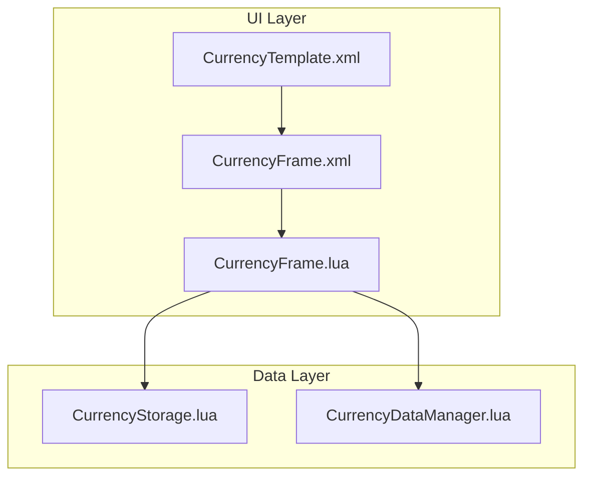
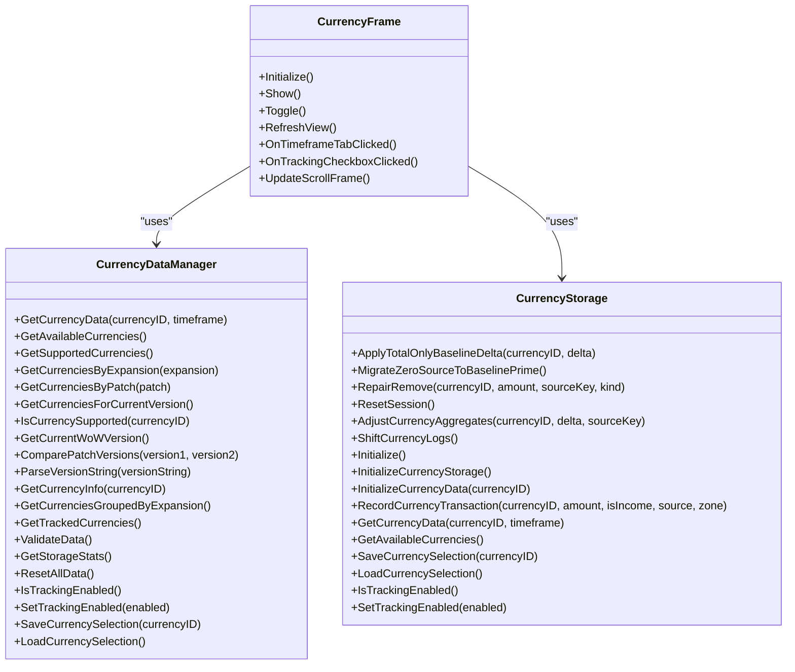
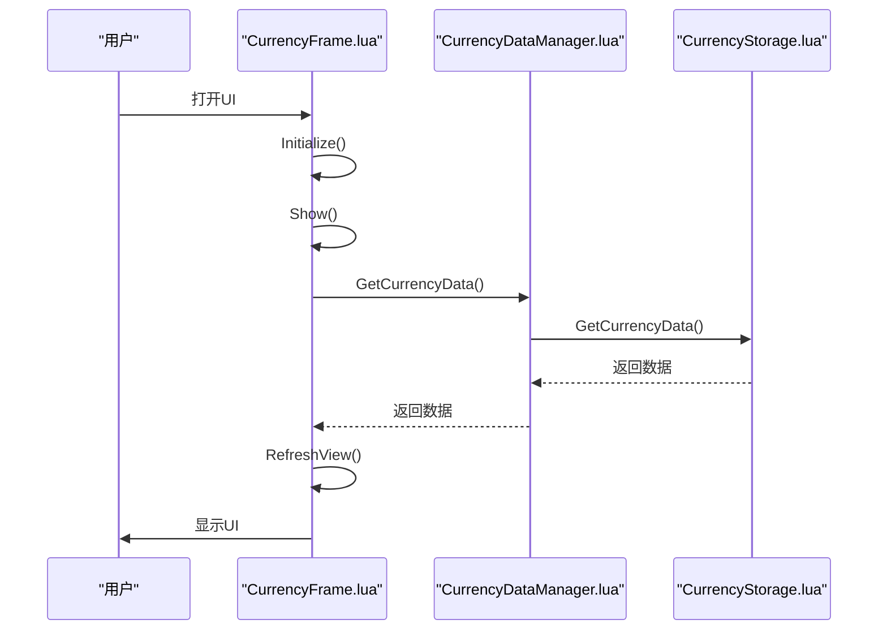
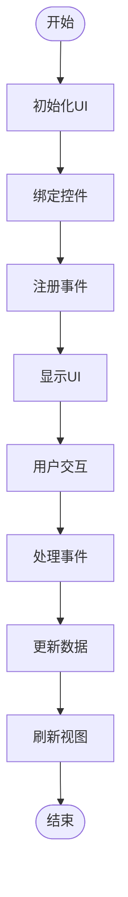
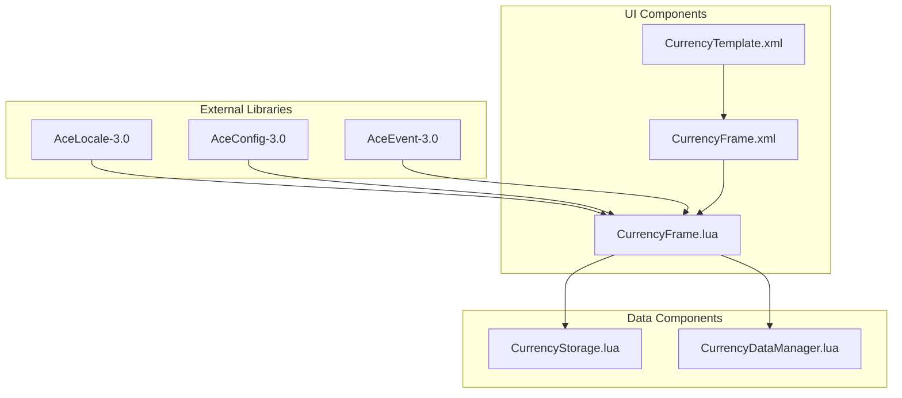

# 用户界面组件

<cite>
**本文档引用的文件**  
- [CurrencyFrame.lua](file://CurrencyTracker/CurrencyFrame.lua)
- [CurrencyFrame.xml](file://CurrencyTracker/CurrencyFrame.xml)
- [CurrencyTemplate.xml](file://CurrencyTracker/CurrencyTemplate.xml)
- [CurrencyStorage.lua](file://CurrencyTracker/CurrencyStorage.lua)
- [CurrencyDataManager.lua](file://CurrencyTracker/CurrencyDataManager.lua)
</cite>

## 目录
1. [简介](#简介)
2. [项目结构](#项目结构)
3. [核心组件](#核心组件)
4. [架构概述](#架构概述)
5. [详细组件分析](#详细组件分析)
6. [依赖分析](#依赖分析)
7. [性能考虑](#性能考虑)
8. [故障排除指南](#故障排除指南)
9. [结论](#结论)

## 简介
货币跟踪模块的UI组件为玩家提供了一个轻量级的界面，用于可视化和管理游戏中的货币数据。该UI作为命令行界面（CLI）的补充，通过直观的图形化展示增强了用户体验。UI的主要功能包括显示货币的收入、支出、净额和总上限，支持多种时间范围的切换，并允许用户自定义视图。UI与后端数据层（CurrencyStorage）紧密集成，确保数据的实时更新和状态同步。此外，UI设计考虑了可扩展性和本地化支持，为未来的功能增强和多语言适配奠定了基础。

## 项目结构
货币跟踪模块的UI组件主要由以下几个文件构成：`CurrencyFrame.lua`、`CurrencyFrame.xml`、`CurrencyTemplate.xml`、`CurrencyStorage.lua`和`CurrencyDataManager.lua`。这些文件共同实现了UI的布局、逻辑控制、数据存储和管理功能。`CurrencyFrame.lua`负责UI的控制逻辑，包括状态管理、交互处理和渲染绑定；`CurrencyFrame.xml`定义了UI的静态布局和模板，确保视觉风格与Gold UI一致；`CurrencyTemplate.xml`提供了UI元素的模板，如按钮和下拉菜单；`CurrencyStorage.lua`管理持久化存储，确保数据的完整性和一致性；`CurrencyDataManager.lua`则负责所有货币数据的操作和存储，提供通用的跟踪逻辑。

**图表来源**
- [CurrencyFrame.lua](file://CurrencyTracker/CurrencyFrame.lua#L1-L1220)
- [CurrencyFrame.xml](file://CurrencyTracker/CurrencyFrame.xml#L1-L673)
- [CurrencyTemplate.xml](file://CurrencyTracker/CurrencyTemplate.xml#L1-L77)
- [CurrencyStorage.lua](file://CurrencyTracker/CurrencyStorage.lua#L1-L1222)
- [CurrencyDataManager.lua](file://CurrencyTracker/CurrencyDataManager.lua#L1-L426)

## 核心组件
货币跟踪模块的UI组件主要包括`CurrencyFrame.lua`、`CurrencyFrame.xml`和`CurrencyTemplate.xml`三个核心文件。`CurrencyFrame.lua`是UI的控制逻辑中心，负责加载和绑定XML中的控件、注册事件回调、处理用户交互和数据渲染。`CurrencyFrame.xml`定义了UI的静态布局和模板，包括主Frame、行模板和时间范围按钮，确保视觉风格与Gold UI一致。`CurrencyTemplate.xml`提供了UI元素的模板，如按钮和下拉菜单，支持复用和迭代，减少代码冗余。

**组件来源**
- [CurrencyFrame.lua](file://CurrencyTracker/CurrencyFrame.lua#L1-L1220)
- [CurrencyFrame.xml](file://CurrencyTracker/CurrencyFrame.xml#L1-L673)
- [CurrencyTemplate.xml](file://CurrencyTracker/CurrencyTemplate.xml#L1-L77)

## 架构概述
货币跟踪模块的UI架构分为UI层和数据层。UI层由`CurrencyFrame.lua`、`CurrencyFrame.xml`和`CurrencyTemplate.xml`组成，负责UI的布局、逻辑控制和用户交互。数据层由`CurrencyStorage.lua`和`CurrencyDataManager.lua`组成，负责数据的持久化存储和管理。UI层通过调用数据层的API获取和更新数据，确保数据的实时性和一致性。UI层和数据层之间的交互通过事件和回调机制实现，确保了系统的解耦和灵活性。

**图表来源**
- [CurrencyFrame.lua](file://CurrencyTracker/CurrencyFrame.lua#L1-L1220)
- [CurrencyFrame.xml](file://CurrencyTracker/CurrencyFrame.xml#L1-L673)
- [CurrencyTemplate.xml](file://CurrencyTracker/CurrencyTemplate.xml#L1-L77)
- [CurrencyStorage.lua](file://CurrencyTracker/CurrencyStorage.lua#L1-L1222)
- [CurrencyDataManager.lua](file://CurrencyTracker/CurrencyDataManager.lua#L1-L426)

## 详细组件分析
### CurrencyFrame.lua 分析
`CurrencyFrame.lua`是UI的控制逻辑中心，负责加载和绑定XML中的控件、注册事件回调、处理用户交互和数据渲染。该文件定义了多个函数，如`Initialize()`、`Show()`、`Toggle()`、`RefreshView()`等，用于初始化UI、显示/隐藏窗口、刷新视图等。`Initialize()`函数加载和绑定XML中的控件，注册事件回调；`Show()`和`Toggle()`函数用于显示/隐藏窗口，设置默认状态；`RefreshView()`函数根据当前模式和时间范围调用数据获取器（`GetMultipleCurrenciesData`或`GetCurrencyDetailData`），并渲染行模板。

#### 类图

**图表来源**
- [CurrencyFrame.lua](file://CurrencyTracker/CurrencyFrame.lua#L1-L1220)
- [CurrencyDataManager.lua](file://CurrencyTracker/CurrencyDataManager.lua#L1-L426)
- [CurrencyStorage.lua](file://CurrencyTracker/CurrencyStorage.lua#L1-L1222)

### CurrencyFrame.xml 分析
`CurrencyFrame.xml`定义了UI的静态布局和模板，包括主Frame、行模板和时间范围按钮。主Frame定义了UI的尺寸、贴图、标题和关闭按钮；行模板定义了表格行的布局，支持“全部货币模式”和“单货币模式”两种渲染模式；时间范围按钮条定义了底部的时间范围选择按钮，支持多种时间范围的切换。XML文件的好处在于更容易复用Gold的皮肤与对齐方式，布局结构直观，减少Lua代码体量与样式分散。

#### 序列图

**图表来源**
- [CurrencyFrame.lua](file://CurrencyTracker/CurrencyFrame.lua#L1-L1220)
- [CurrencyDataManager.lua](file://CurrencyTracker/CurrencyDataManager.lua#L1-L426)
- [CurrencyStorage.lua](file://CurrencyTracker/CurrencyStorage.lua#L1-L1222)

### CurrencyTemplate.xml 分析
`CurrencyTemplate.xml`提供了UI元素的模板，如按钮和下拉菜单，支持复用和迭代，减少代码冗余。模板文件定义了按钮的样式、大小、位置和事件处理，确保UI元素的一致性和可维护性。通过复用模板，可以快速创建新的UI元素，提高开发效率。

#### 流程图

**图表来源**
- [CurrencyFrame.lua](file://CurrencyTracker/CurrencyFrame.lua#L1-L1220)
- [CurrencyFrame.xml](file://CurrencyTracker/CurrencyFrame.xml#L1-L673)
- [CurrencyTemplate.xml](file://CurrencyTracker/CurrencyTemplate.xml#L1-L77)

## 依赖分析
货币跟踪模块的UI组件依赖于多个外部库和模块，包括`AceLocale-3.0`、`AceConfig-3.0`、`AceEvent-3.0`等。这些库提供了本地化、配置管理和事件处理功能，确保UI的可扩展性和灵活性。UI组件还依赖于`CurrencyStorage`和`CurrencyDataManager`模块，用于数据的持久化存储和管理。通过依赖注入和事件回调机制，UI组件与后端数据层实现了松耦合，确保了系统的稳定性和可维护性。

**图表来源**
- [CurrencyFrame.lua](file://CurrencyTracker/CurrencyFrame.lua#L1-L1220)
- [CurrencyFrame.xml](file://CurrencyTracker/CurrencyFrame.xml#L1-L673)
- [CurrencyTemplate.xml](file://CurrencyTracker/CurrencyTemplate.xml#L1-L77)
- [CurrencyStorage.lua](file://CurrencyTracker/CurrencyStorage.lua#L1-L1222)
- [CurrencyDataManager.lua](file://CurrencyTracker/CurrencyDataManager.lua#L1-L426)

## 性能考虑
货币跟踪模块的UI组件在设计时充分考虑了性能优化。UI打开时延迟拉取数据，避免不必要的资源消耗；切换时间范围时使用轻量刷新，避免反复扫描数据；大数据量滚动使用`FauxScrollFrameTemplate`，确保滚动流畅。此外，UI组件通过事件和回调机制与后端数据层交互，确保数据的实时更新和状态同步，同时减少不必要的数据传输和处理。

## 故障排除指南
### 无数据时的处理
当没有货币数据时，UI应显示“无货币数据”提示，避免用户困惑。可以通过检查`currentData`数组的长度来判断是否有数据，如果没有数据，则显示提示信息。

### 追踪复选框的处理
追踪复选框的点击事件应立即更新`Storage:GetDiscoveredCurrencies()[id].tracked`状态，并触发一次`RefreshView()`，确保UI的实时更新。如果复选框的状态没有正确更新，可以检查`OnTrackingCheckboxClicked`函数的实现，确保调用了正确的API。

### 时间范围按钮的联动
时间范围按钮的点击事件应更新`currentTimeframe`状态，并调用`RefreshView()`，确保UI的实时更新。如果按钮的联动没有生效，可以检查`OnTimeframeTabClicked`函数的实现，确保正确更新了状态并触发了刷新。

**组件来源**
- [CurrencyFrame.lua](file://CurrencyTracker/CurrencyFrame.lua#L1-L1220)
- [CurrencyStorage.lua](file://CurrencyTracker/CurrencyStorage.lua#L1-L1222)

## 结论
货币跟踪模块的UI组件通过轻量级的界面设计，为玩家提供了直观的货币数据可视化功能。UI与后端数据层的紧密集成确保了数据的实时更新和状态同步，同时通过事件和回调机制实现了系统的解耦和灵活性。UI设计考虑了可扩展性和本地化支持，为未来的功能增强和多语言适配奠定了基础。通过合理的性能优化和故障排除指南，确保了系统的稳定性和用户体验。