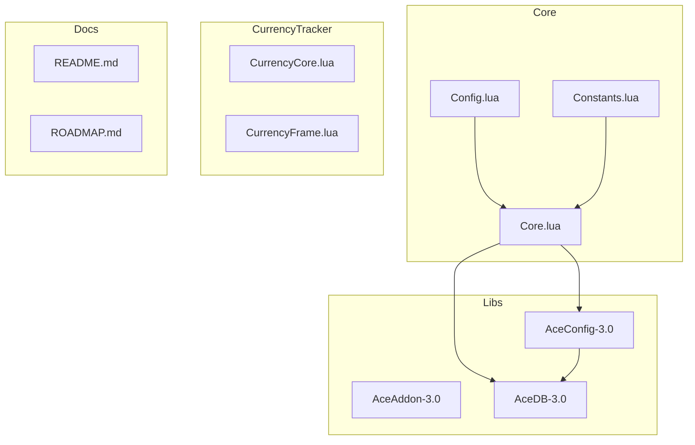
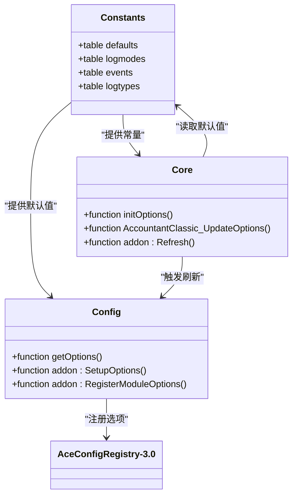
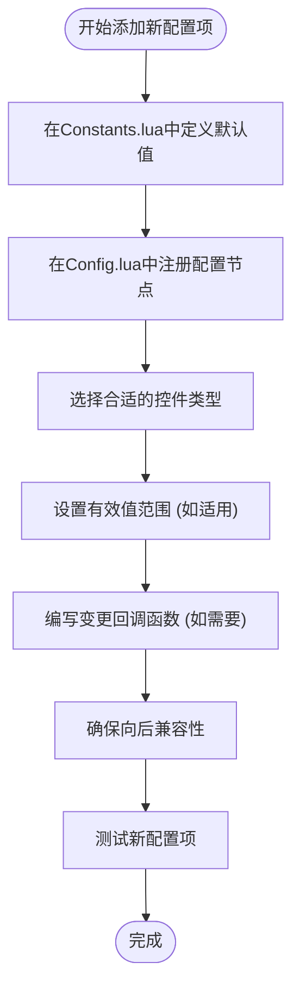
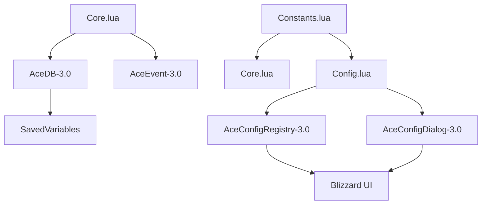

# 扩展配置系统

<cite>
**本文档中引用的文件**  
- [Config.lua](file://Core/Config.lua)
- [Constants.lua](file://Core/Constants.lua)
- [Core.lua](file://Core/Core.lua)
</cite>

## 目录
1. [简介](#简介)
2. [项目结构](#项目结构)
3. [核心组件](#核心组件)
4. [架构概述](#架构概述)
5. [详细组件分析](#详细组件分析)
6. [依赖分析](#依赖分析)
7. [性能考虑](#性能考虑)
8. [故障排除指南](#故障排除指南)
9. [结论](#结论)

## 简介
本文档为开发者提供了一个完整的指南，用于向Accountant_Classic插件添加新的配置项。文档详细说明了从在DEFAULTS表中定义默认值，到在Config.lua中注册新的配置节点的完整流程。包括选择合适的控件类型、设置有效值范围、编写变更回调函数，以及确保向后兼容性的最佳实践。通过一个具体示例——如何添加一个控制“区域级细分”功能的新开关，并将其与核心逻辑关联——来演示整个过程。同时强调了避免命名冲突和正确处理数据类型的重要性，并介绍了调试配置系统常见问题的方法。

## 项目结构
Accountant_Classic插件的项目结构清晰地分为几个主要目录：Core（核心功能）、CurrencyTracker（货币追踪）、Docs（文档）和Libs（第三方库）。这种组织方式有助于分离关注点，使得代码更易于维护和扩展。



**Diagram sources**
- [Config.lua](file://Core/Config.lua#L1-L430)
- [Constants.lua](file://Core/Constants.lua#L1-L260)
- [Core.lua](file://Core/Core.lua#L1-L2334)

**Section sources**
- [Config.lua](file://Core/Config.lua#L1-L430)
- [Constants.lua](file://Core/Constants.lua#L1-L260)
- [Core.lua](file://Core/Core.lua#L1-L2334)

## 核心组件
本节深入分析Accountant_Classic插件的核心组件，特别是与配置系统相关的部分。重点在于理解`Config.lua`和`Constants.lua`文件中的关键数据结构和函数，这些是实现可扩展配置系统的基础。

**Section sources**
- [Config.lua](file://Core/Config.lua#L1-L430)
- [Constants.lua](file://Core/Constants.lua#L1-L260)

## 架构概述
Accountant_Classic插件采用模块化设计，利用Ace3框架（AceAddon-3.0, AceConfig-3.0等）来管理插件生命周期、配置和用户界面。配置系统的核心是`Constants.lua`中的`constants.defaults`表，它定义了所有配置项的默认值。`Config.lua`则负责将这些默认值注册到AceConfig系统中，并生成用户可交互的选项界面。



**Diagram sources**
- [Constants.lua](file://Core/Constants.lua#L1-L260)
- [Config.lua](file://Core/Config.lua#L1-L430)
- [Core.lua](file://Core/Core.lua#L1-L2334)

## 详细组件分析
本节将详细分析如何向配置系统添加新配置项的完整流程。

### 添加新配置项的完整流程
向Accountant_Classic插件添加新的配置项需要遵循一个明确的步骤，以确保配置的持久化、UI的正确显示以及与核心逻辑的正确集成。

#### 1. 定义默认值
首先，需要在`Constants.lua`文件的`constants.defaults.profile`表中定义新配置项的默认值。这是确保新用户或新角色获得合理默认设置的关键。

例如，要添加一个名为`enable_zone_breakdown`的新布尔值配置项（用于控制“区域级细分”功能），应在`constants.defaults.profile`中添加：
```lua
enable_zone_breakdown = true, -- 是否启用区域级细分
```

这个默认值会在用户首次使用插件或创建新角色时被应用。

**Section sources**
- [Constants.lua](file://Core/Constants.lua#L1-L260)

#### 2. 在Config.lua中注册配置节点
接下来，在`Config.lua`文件的`getOptions()`函数中，找到合适的配置组（例如`group_tracking`），并添加新的配置节点。



**Diagram sources**
- [Constants.lua](file://Core/Constants.lua#L1-L260)
- [Config.lua](file://Core/Config.lua#L1-L430)

**Section sources**
- [Constants.lua](file://Core/Constants.lua#L1-L260)
- [Config.lua](file://Core/Config.lua#L1-L430)

#### 3. 选择合适的控件类型
AceConfig-3.0提供了多种UI控件（Widgets），开发者应根据配置项的数据类型和用途选择最合适的控件。

- **布尔值 (true/false)**: 使用`type = "toggle"`，对应复选框。
- **数值范围**: 使用`type = "range"`，对应滑块。
- **枚举/选择**: 使用`type = "select"`，对应下拉菜单。
- **执行操作**: 使用`type = "execute"`，对应按钮。

对于`enable_zone_breakdown`，应使用`toggle`控件。

#### 4. 设置有效值范围
如果配置项是数值类型，应使用`min`、`max`和`bigStep`字段来定义其有效范围和步长。对于布尔值或选择项，`values`字段用于定义可选项。

#### 5. 编写变更回调函数
如果配置项的变更需要立即触发某些逻辑（如刷新UI、重新注册事件等），可以在`set`字段中定义一个回调函数。该函数会在用户更改配置时被调用。

例如，`enable_zone_breakdown`的变更可能需要立即刷新主界面以显示或隐藏区域数据：
```lua
set = function(info, value)
    addon.db.profile.enable_zone_breakdown = value
    addon:Refresh() -- 调用核心的刷新函数
end,
```

#### 6. 确保向后兼容性
为了确保旧版本的用户在更新后不会丢失配置或遇到错误，`Core.lua`中的`AccountantClassic_UpdateOptions()`函数会自动将`AccountantClassicDefaultOptions`中的新默认值合并到现有用户的配置中。只要新配置项在`constants.defaults`中有定义，系统就能保证向后兼容。

### 具体示例：添加“区域级细分”开关
以下是如何添加一个名为“区域级细分”的新功能开关的完整示例。

1.  **在`Constants.lua`中定义默认值**:
    ```lua
    constants.defaults = {
        profile = {
            -- ... 其他默认值
            enable_zone_breakdown = true, -- 新增：默认启用区域细分
            tracksubzone = true, -- 已存在：子区域追踪
            -- ...
        },
    }
    ```

2.  **在`Config.lua`中注册节点**:
    在`group_tracking`组中添加：
    ```lua
    group_tracking = {
        order = 18, 
        type = "group",
        name = L["Enhanced Tracking Options"],
        inline = true,
        args = {
            trackzone = { ... },
            tracksubzone = { ... },
            enable_zone_breakdown = { -- 新增配置节点
                order = 18.2,
                type = "toggle",
                name = L["Enable Zone Breakdown"],
                desc = L["Show income and expenditure breakdown by zone."],
                width = "full",
                set = function(info, value)
                    addon.db.profile.enable_zone_breakdown = value
                    addon:Refresh() -- 通知核心逻辑刷新
                end,
            },
        },
    },
    ```

3.  **在核心逻辑中使用该配置**:
    在`Core.lua`的`AccountantClassic_OnShow()`或数据处理函数中，检查`profile.enable_zone_breakdown`的值来决定是否显示区域细分数据。

### 最佳实践与注意事项
- **避免命名冲突**: 使用清晰、唯一的名称，并考虑使用前缀（如`enable_`, `show_`）来提高可读性。
- **正确处理数据类型**: 确保在`constants.defaults`中定义的默认值类型与代码中使用的类型一致（例如，不要将字符串`"true"`与布尔值`true`混淆）。
- **提供本地化**: 所有用户界面文本（`name`, `desc`）都应通过`L[]`表进行本地化。
- **调试常见问题**:
    - **配置项不显示**: 检查`Config.lua`中的`order`值是否正确，以及`getOptions()`函数是否被正确调用。
    - **更改不生效**: 确认`set`回调函数是否正确更新了`db.profile`，并调用了`addon:Refresh()`或其他必要的刷新函数。
    - **向后兼容性问题**: 确保所有新配置项都在`constants.defaults`中有定义，并且`AccountantClassic_UpdateOptions()`函数在启动时被调用。

## 依赖分析
Accountant_Classic插件的配置系统高度依赖于Ace3框架的多个组件。



**Diagram sources**
- [Config.lua](file://Core/Config.lua#L1-L430)
- [Core.lua](file://Core/Core.lua#L1-L2334)
- [Constants.lua](file://Core/Constants.lua#L1-L260)

**Section sources**
- [Config.lua](file://Core/Config.lua#L1-L430)
- [Core.lua](file://Core/Core.lua#L1-L2334)
- [Constants.lua](file://Core/Constants.lua#L1-L260)

## 性能考虑
配置系统的性能开销主要来自于AceConfig框架的UI渲染。由于配置界面不是常驻界面，因此其性能影响通常可以忽略不计。核心逻辑的性能关键在于`addon:Refresh()`函数的效率，该函数在配置变更时被频繁调用，应确保其内部逻辑尽可能高效。

## 故障排除指南
当开发者在扩展配置系统时遇到问题，可以参考以下常见问题的排查方法。

**Section sources**
- [Config.lua](file://Core/Config.lua#L1-L430)
- [Core.lua](file://Core/Core.lua#L1-L2334)

## 结论
通过遵循本文档中描述的流程，开发者可以安全、高效地为Accountant_Classic插件添加新的配置项。关键在于理解`Constants.lua`、`Config.lua`和`Core.lua`三个文件之间的协作关系：`Constants.lua`提供默认值和常量，`Config.lua`负责UI绑定和用户交互，而`Core.lua`则处理核心逻辑和状态管理。利用Ace3框架的强大功能，可以构建出既灵活又稳定的配置系统。