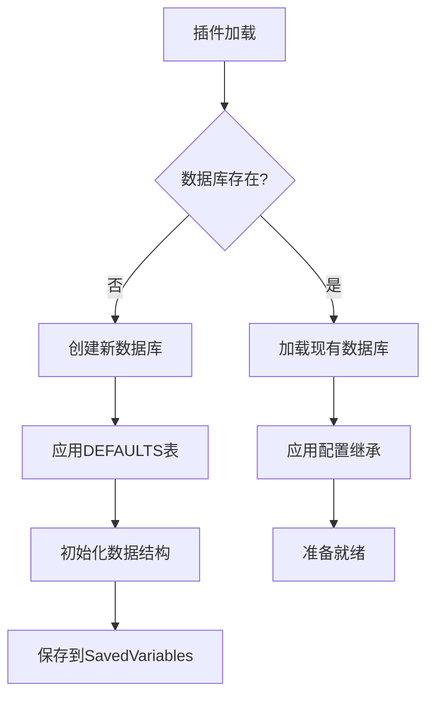
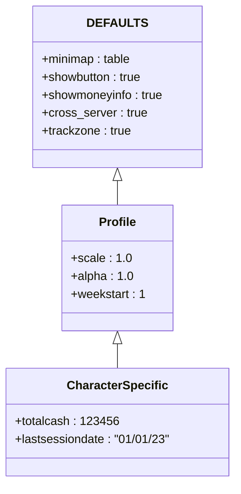
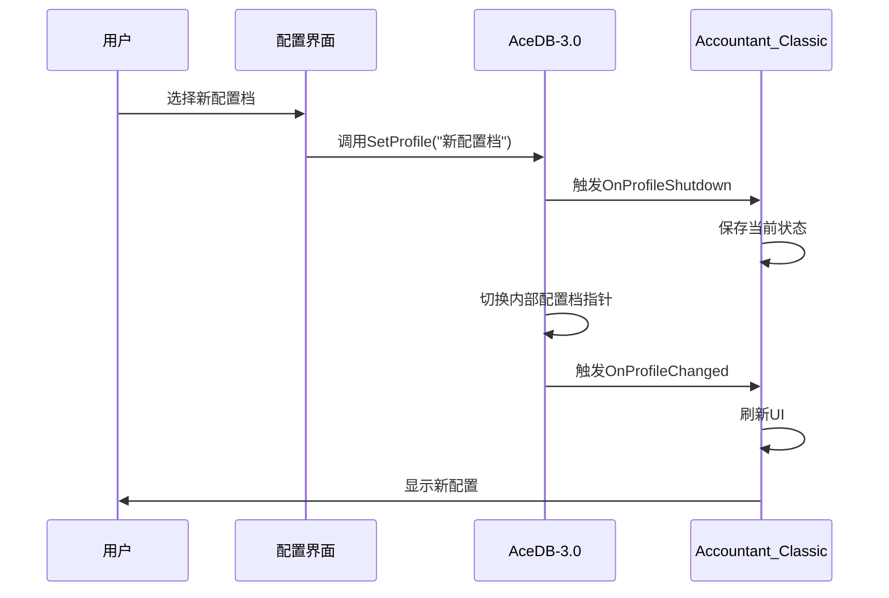

# 配置存储与持久化

<cite>
**本文档引用的文件**  
- [Core.lua](file://Core/Core.lua)
- [Config.lua](file://Core/Config.lua)
- [Constants.lua](file://Core/Constants.lua)
- [AceDB-3.0.lua](file://Libs/AceDB-3.0/AceDB-3.0.lua)
- [AceDBOptions-3.0.lua](file://Libs/AceDBOptions-3.0/AceDBOptions-3.0.lua)
</cite>

## 目录
1. [简介](#简介)
2. [数据库初始化与持久化](#数据库初始化与持久化)
3. [配置继承模型与优先级](#配置继承模型与优先级)
4. [配置档管理与切换](#配置档管理与切换)
5. [DEFAULTS表与模板填充](#defaults表与模板填充)
6. [核心API与代码示例](#核心api与代码示例)

## 简介
Accountant_Classic是一款用于追踪《魔兽世界》经典版中角色金钱收支的插件。该插件利用AceDB-3.0库实现强大的配置持久化和管理功能，确保用户的配置数据在游戏会话之间保持一致。通过AceDB-3.0，插件支持复杂的配置继承模型，允许用户在全局配置档（profile）和角色特定设置之间灵活切换。这种设计不仅保证了配置的持久性，还提供了高度的自定义能力，使用户能够为不同的角色或场景创建和管理独立的配置。本文档将详细阐述其配置持久化机制、继承模型、初始化过程以及相关的API使用方法。

## 数据库初始化与持久化
Accountant_Classic通过AceDB-3.0库自动将配置数据保存到SavedVariables中，确保跨会话的持久性。在插件的`OnInitialize`方法中，调用`AceDB:New`函数来创建和初始化数据库对象。该函数接收三个主要参数：数据库变量名、默认值表和默认配置档标识。当插件首次加载时，AceDB-3.0会检查SavedVariables中是否存在对应的数据库文件。如果不存在，它会根据提供的默认值创建一个新的数据库；如果存在，则加载已有的数据。



**Diagram sources**
- [Core.lua](file://Core/Core.lua#L2339-L2345)

数据库的持久化由AceDB-3.0在后台自动处理。每当配置数据发生变化时，AceDB-3.0会确保这些更改最终被写入SavedVariables文件。在`PLAYER_LOGOUT`事件触发时，AceDB-3.0会执行清理操作，移除所有未使用的默认值，从而优化SavedVariables文件的大小。这种机制确保了配置数据的完整性和持久性，同时避免了不必要的存储开销。

**Section sources**
- [Core.lua](file://Core/Core.lua#L2339-L2345)
- [AceDB-3.0.lua](file://Libs/AceDB-3.0/AceDB-3.0.lua#L600-L650)

## 配置继承模型与优先级
AceDB-3.0提供了一个强大的配置继承模型，允许不同层级的配置数据相互覆盖。在Accountant_Classic中，配置的优先级从高到低依次为：角色特定设置、全局配置档（profile）、默认值（DEFAULTS）。这意味着，如果某个配置项在角色特定设置中被定义，它将覆盖全局配置档中的同名项；而全局配置档中的设置又会覆盖DEFAULTS表中的默认值。



**Diagram sources**
- [Constants.lua](file://Core/Constants.lua#L10-L45)
- [Core.lua](file://Core/Core.lua#L2339-L2345)

这种继承模型通过AceDB-3.0的元表（metatable）机制实现。当访问数据库中的某个配置项时，AceDB-3.0会首先检查当前配置档中是否存在该值。如果不存在，它会递归地向上查找，直到在DEFAULTS表中找到默认值。这确保了即使用户删除了某个配置项，系统也能回退到一个安全的默认状态。在Accountant_Classic中，这一机制被用来管理从界面缩放、透明度到金钱追踪选项等各种设置。

**Section sources**
- [AceDB-3.0.lua](file://Libs/AceDB-3.0/AceDB-3.0.lua#L200-L350)
- [Constants.lua](file://Core/Constants.lua#L10-L45)

## 配置档管理与切换
AceDB-3.0提供了完整的API来管理配置档，包括创建、复制、删除和切换。在Accountant_Classic中，用户可以通过插件的配置界面来管理这些配置档。`SetProfile` API是切换配置档的核心方法，它接受一个配置档名称作为参数，并将当前活动的配置档切换到指定的名称。当调用此方法时，AceDB-3.0会触发`OnProfileShutdown`回调，允许插件在切换前保存当前状态，然后触发`OnProfileChanged`回调，通知插件配置档已成功切换。



**Diagram sources**
- [AceDB-3.0.lua](file://Libs/AceDB-3.0/AceDB-3.0.lua#L400-L450)
- [Config.lua](file://Core/Config.lua#L200-L250)

除了`SetProfile`，AceDB-3.0还提供了`GetProfiles`、`DeleteProfile`和`CopyProfile`等方法，用于查询、删除和复制配置档。这些功能通过AceDBOptions-3.0库集成到Blizzard的原生配置界面中，为用户提供了一个直观的管理体验。例如，`CopyProfile`方法允许用户将一个现有配置档的所有设置复制到当前配置档，这对于快速创建相似配置非常有用。

**Section sources**
- [AceDB-3.0.lua](file://Libs/AceDB-3.0/AceDB-3.0.lua#L400-L500)
- [AceDBOptions-3.0.lua](file://Libs/AceDBOptions-3.0/AceDBOptions-3.0.lua#L1-L50)

## DEFAULTS表与模板填充
DEFAULTS表是AceDB-3.0配置系统的基础，它定义了所有配置项的默认值。在Accountant_Classic中，DEFAULTS表被定义在`Constants.lua`文件的`constants.defaults`中。当创建一个新的配置档时，AceDB-3.0会使用这个DEFAULTS表作为模板来填充新配置档。这个过程确保了每个新配置档都从一组已知的、安全的默认值开始。

```lua
constants.defaults = {
	profile = {
		minimap = {
			hide = false,
			show = true,
			minimapPos = 153,
		},
		showbutton = true, 
		showmoneyinfo = true, 
		cross_server = true,
		trackzone = true,
		tracksubzone = true,
		weekstart = 1,
		-- ... 其他默认值
	},
}
```

当调用`AceDB:New`创建数据库时，如果指定的配置档不存在，AceDB-3.0会自动创建一个以DEFAULTS表为模板的新配置档。这个新配置档随后会被保存到SavedVariables中，成为该角色或账户的持久化配置。DEFAULTS表的设计使得插件的更新变得简单：开发者可以在新版本中添加新的配置项到DEFAULTS表，当老用户更新插件后，AceDB-3.0会自动将这些新配置项添加到他们的现有配置档中，而不会影响他们已有的设置。

**Section sources**
- [Constants.lua](file://Core/Constants.lua#L10-L45)
- [Core.lua](file://Core/Core.lua#L2339-L2345)

## 核心API与代码示例
以下代码片段展示了Accountant_Classic中数据库注册、配置档切换和数据访问的关键方法。


**Diagram sources**
- [Core.lua](file://Core/Core.lua#L2339-L2345)

### 数据库注册
在`OnInitialize`方法中，插件通过`AceDB:New`创建数据库实例。这行代码是整个配置系统的基础。

**Section sources**
- [Core.lua](file://Core/Core.lua#L2339-L2345)

### 配置档切换
通过`SetProfile`方法可以动态切换配置档，这通常在用户通过配置界面选择时触发。

**Section sources**
- [AceDB-3.0.lua](file://Libs/AceDB-3.0/AceDB-3.0.lua#L400-L450)

### 数据访问
一旦数据库初始化完成，插件代码就可以通过`addon.db.profile`来访问当前配置档中的数据，实现对配置的读写操作。

**Section sources**
- [Core.lua](file://Core/Core.lua#L2339-L2345)
- [Config.lua](file://Core/Config.lua#L10-L50)