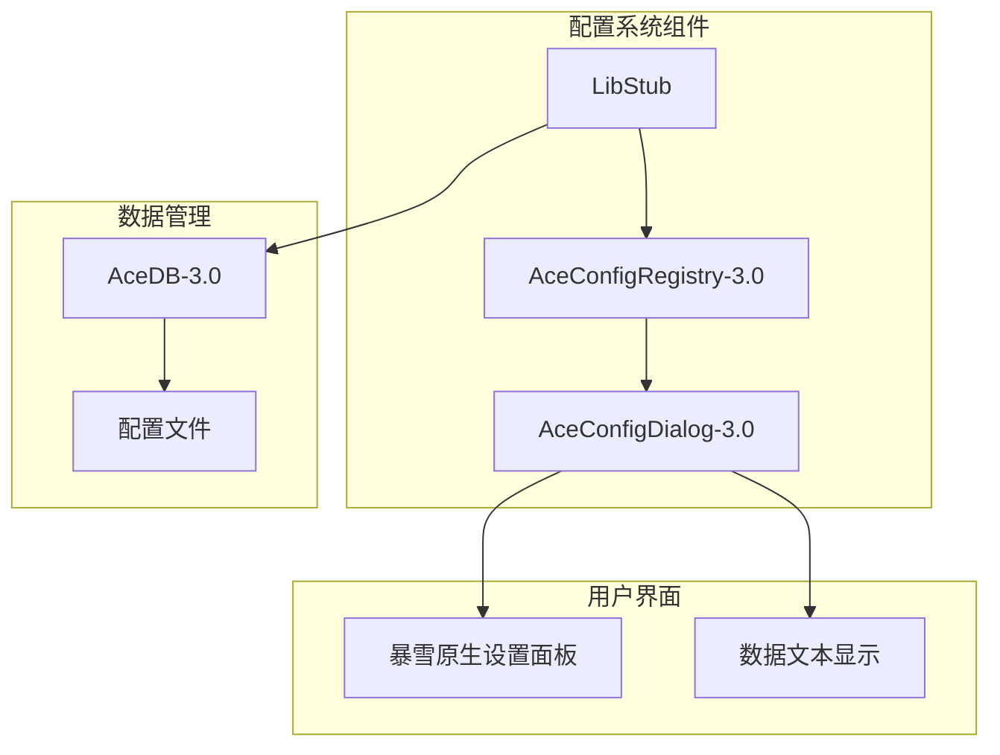
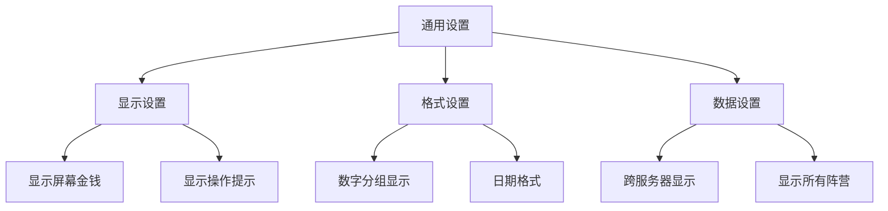
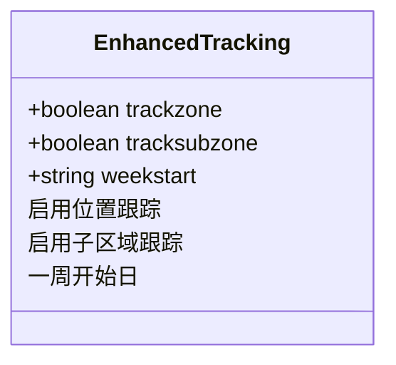
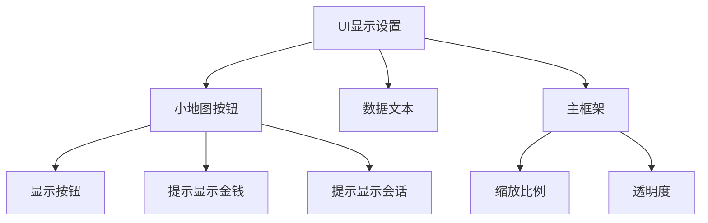
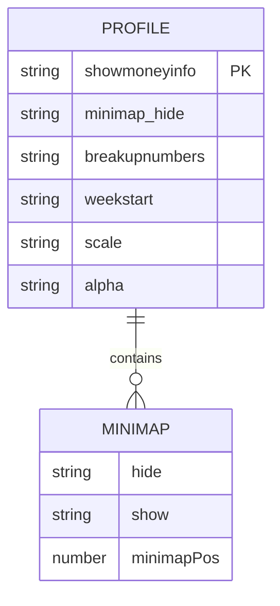
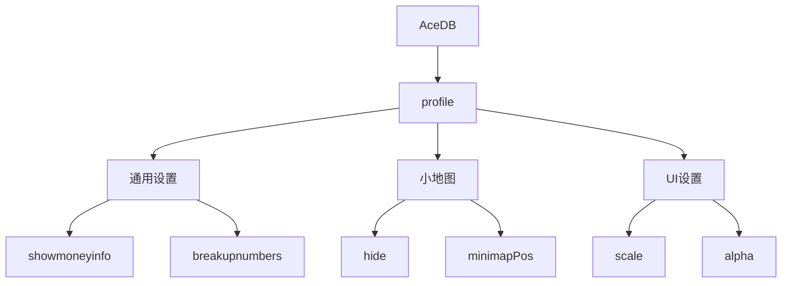

# 配置定义与结构

<cite>
**本文档中引用的文件**  
- [Config.lua](file://Core/Config.lua)
- [Constants.lua](file://Core/Constants.lua)
</cite>

## 目录
1. [简介](#简介)
2. [配置系统架构](#配置系统架构)
3. [核心配置树结构](#核心配置树结构)
4. [配置分组实现](#配置分组实现)
5. [配置项类型与属性](#配置项类型与属性)
6. [默认值来源与结构设计](#默认值来源与结构设计)
7. [嵌套配置项定义示例](#嵌套配置项定义示例)
8. [配置键名命名规范](#配置键名命名规范)
9. [数据存储路径映射](#数据存储路径映射)
10. [总结](#总结)

## 简介
本文件深入讲解Accountant_Classic插件中配置系统的定义机制，重点分析通过AceConfig-3.0构建的配置树结构。详细说明配置分组的实现方式、配置项的类型与属性、默认值来源以及命名规范。

## 配置系统架构
Accountant_Classic使用Ace3框架的AceConfig-3.0模块构建其配置系统，实现了模块化、可扩展的选项管理。系统通过AceConfigRegistry-3.0注册配置表，通过AceConfigDialog-3.0在游戏内创建用户界面。



**图示来源**
- [Config.lua](file://Core/Config.lua#L1-L50)
- [Constants.lua](file://Core/Constants.lua#L1-L20)

## 核心配置树结构
配置系统的核心是通过`getOptions()`函数构建的配置树结构，该结构遵循AceConfig-3.0的规范，以嵌套的Lua表形式组织。

```lua
options = {
    type = "group",
    name = addon.LocName,
    args = {
        -- 配置分组和选项项
    }
}
```

配置树的根节点是一个类型为"group"的组，包含多个子分组和配置项。每个节点都有特定的属性来定义其行为和外观。

**节来源**
- [Config.lua](file://Core/Config.lua#L119-L125)

## 配置分组实现
配置系统通过多个嵌套的分组来组织选项，每个分组代表一个逻辑功能区域。

### 通用设置分组
通用设置分组包含基础功能的开关和显示格式设置。



**图示来源**
- [Config.lua](file://Core/Config.lua#L136-L200)

### 增强跟踪分组
增强跟踪分组提供地理位置相关的财务跟踪功能。



**图示来源**
- [Config.lua](file://Core/Config.lua#L206-L222)

### UI显示分组
UI显示分组控制各种用户界面元素的外观和行为。



**图示来源**
- [Config.lua](file://Core/Config.lua#L250-L304)

## 配置项类型与属性
配置系统支持多种类型的配置项，每种类型都有特定的属性和行为。

### 配置项类型
系统使用AceConfig-3.0支持的标准配置项类型：

**类型定义：**
- :toggle: 布尔开关，用于启用/禁用功能
- :range: 范围选择器，用于选择数值范围
- :select: 下拉选择器，用于从预定义选项中选择
- :execute: 执行按钮，用于触发特定操作
- :description: 描述文本，用于显示说明信息
- :group: 分组容器，用于组织相关配置项

**节来源**
- [Config.lua](file://Core/Config.lua#L119-L371)

### 配置项属性
每个配置项都有一组标准属性来定义其行为：

**属性定义：**
- :order: 数值，定义配置项在界面中的显示顺序
- :type: 字符串，定义配置项的类型
- :name: 字符串，配置项的显示名称
- :desc: 字符串，配置项的描述文本
- :width: 字符串，定义配置项的宽度（"full"或"double"）
- :get: 函数，获取配置项当前值的回调函数
- :set: 函数，设置配置项新值的回调函数
- :disabled: 函数，判断配置项是否禁用的回调函数
- :values: 函数，返回下拉选择器选项的函数
- :isPercent: 布尔值，指示范围选择器是否显示为百分比

**节来源**
- [Config.lua](file://Core/Config.lua#L144-L151)

## 默认值来源与结构设计
配置系统的默认值来源于Constants.lua文件中的DEFAULTS表，遵循清晰的结构设计原则。

### 默认值结构
默认值采用分层结构，与配置树的结构相对应：



**图示来源**
- [Constants.lua](file://Core/Constants.lua#L20-L45)

### 结构设计原则
默认值结构设计遵循以下原则：

1. **分层组织**：按功能模块分层组织配置项
2. **类型一致性**：确保默认值类型与实际使用类型一致
3. **可扩展性**：结构设计允许未来添加新配置项
4. **向后兼容**：保留旧版本的配置项以确保兼容性
5. **用户友好**：默认值设置为大多数用户期望的合理值

**节来源**
- [Constants.lua](file://Core/Constants.lua#L20-L45)

## 嵌套配置项定义示例
以下是一个包含嵌套分组的配置项定义示例：

```lua
group4 = {
    order = 40,
    type = "group",
    name = L["Scale and Transparency"],
    inline = true,
    args = {
        group41 = {
            order = 41,
            type = "group",
            name = L["Main Frame's Scale and Alpha Settings"],
            inline = true,
            args = {
                scale = {
                    order = 42,
                    type = "range",
                    name = L["Accountant Classic Frame's Scale"],
                    min = 0.5, max = 1.75, bigStep = 0.02,
                    isPercent = true,
                    width = "full",
                },
                alpha = {
                    order = 43,
                    type = "range",
                    name = L["Accountant Classic Frame's Transparency"],
                    min = 0.1, max = 1, bigStep = 0.1,
                    isPercent = true,
                    width = "full",
                },
            },
        },
    },
}
```

在游戏内选项面板中，此配置项将呈现为一个主分组"Scale and Transparency"，其中包含一个内联子分组"Main Frame's Scale and Alpha Settings"，子分组中包含两个范围选择器："Scale"和"Transparency"。

**节来源**
- [Config.lua](file://Core/Config.lua#L305-L330)

## 配置键名命名规范
配置系统采用一致的命名规范来确保代码的可读性和可维护性。

### 命名规则
配置键名遵循以下命名规则：

**规则定义：**
- :使用小写字母: 所有键名使用小写字母
- :单词间用下划线: 多个单词间使用下划线分隔
- :描述性命名: 键名应清晰描述其功能
- :避免缩写: 尽量使用完整单词而非缩写
- :一致性: 相似功能的配置项使用相似的命名模式

**示例：**
- `showmoneyinfo` - 显示金钱信息
- `breakupnumbers` - 数字分组显示
- `rememberSelectedCharacter` - 记住选择的角色
- `cross_server` - 跨服务器显示

**节来源**
- [Config.lua](file://Core/Config.lua#L142-L371)

## 数据存储路径映射
配置键名与数据存储路径之间存在直接映射关系，确保配置值的正确存储和检索。

### 存储路径结构
配置数据存储在AceDB的profile表中，路径结构如下：



**图示来源**
- [Config.lua](file://Core/Config.lua#L50-L90)

### 值获取与设置
通过统一的getter和setter函数实现配置值的获取和设置：

```lua
function optGetter(info)
    local key = info[#info]
    return addon.db.profile[key]
end

function optSetter(info, value)
    local key = info[#info]
    addon.db.profile[key] = value
    addon:Refresh()
end
```

当配置值改变时，系统会调用`addon:Refresh()`方法来更新用户界面，确保配置更改立即生效。

**节来源**
- [Config.lua](file://Core/Config.lua#L50-L90)

## 总结
Accountant_Classic的配置系统通过AceConfig-3.0构建了一个结构清晰、易于使用的选项管理界面。系统采用分层的配置树结构，通过合理的分组组织相关配置项。配置项类型丰富，支持各种用户交互方式。默认值来源于Constants.lua中的结构化表，确保了配置的一致性和可维护性。配置键名遵循清晰的命名规范，并与数据存储路径直接映射，实现了配置值的高效管理。