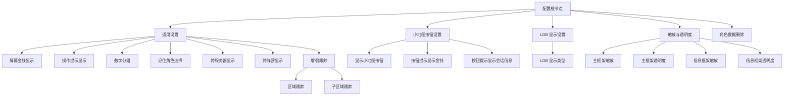
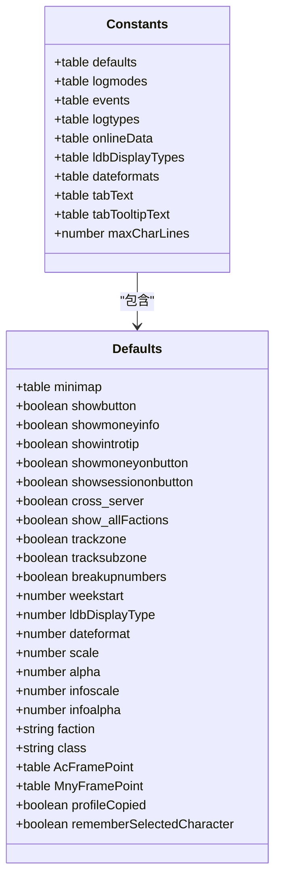
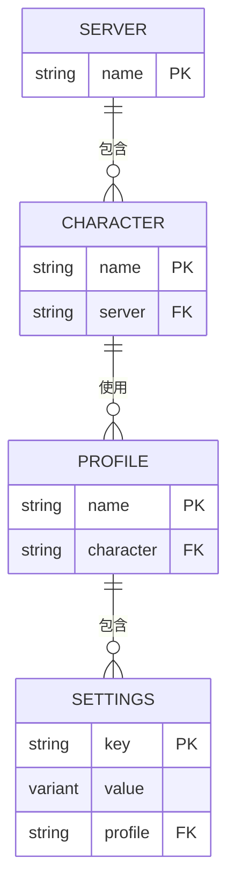
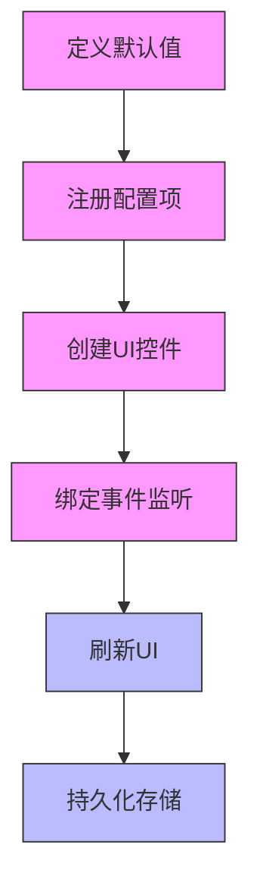
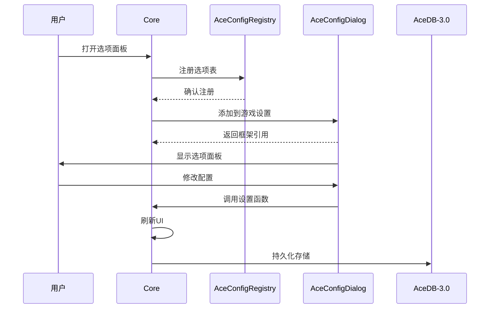
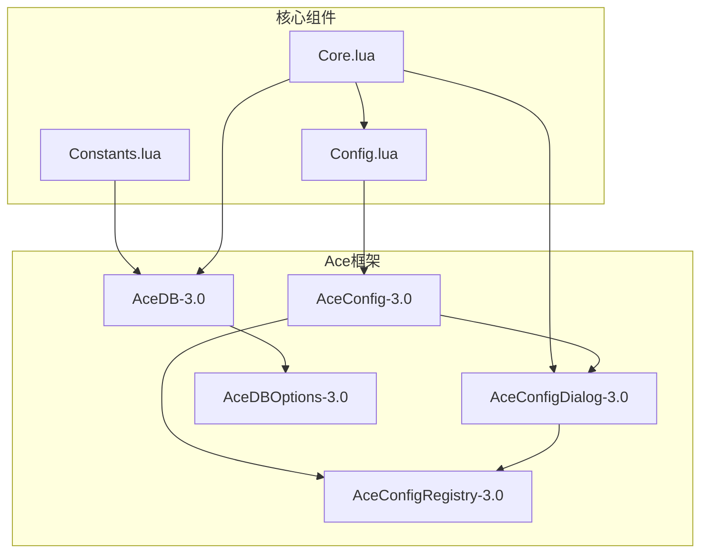

# 配置系统

<cite>
**本文档中引用的文件**  
- [Config.lua](file://Core/Config.lua)
- [Constants.lua](file://Core/Constants.lua)
- [Core.lua](file://Core/Core.lua)
- [AceDB-3.0.lua](file://Libs/AceDB-3.0/AceDB-3.0.lua)
- [AceConfigDialog-3.0.lua](file://Libs/AceConfig-3.0/AceConfigDialog-3.0/AceConfigDialog-3.0.lua)
- [AceConfigRegistry-3.0.lua](file://Libs/AceConfig-3.0/AceConfigRegistry-3.0/AceConfigRegistry-3.0.lua)
- [AceDBOptions-3.0.lua](file://Libs/AceDBOptions-3.0/AceDBOptions-3.0.lua)
</cite>

## 目录
1. [简介](#简介)
2. [配置树结构定义](#配置树结构定义)
3. [默认值与初始化](#默认值与初始化)
4. [配置持久化与角色继承](#配置持久化与角色继承)
5. [可配置选项列表](#可配置选项列表)
6. [开发者指南：添加新配置项](#开发者指南：添加新配置项)
7. [游戏内选项面板生成](#游戏内选项面板生成)
8. [架构概览](#架构概览)

## 简介
Accountant_Classic 使用 AceConfig-3.0 和 AceDB-3.0 构建了一个强大且灵活的配置管理系统。该系统允许用户自定义界面显示、数据跟踪和行为设置，并通过角色特定配置和全局配置的继承机制实现跨角色设置管理。配置数据通过 WoW 的 SavedVariables 系统自动持久化，确保设置在游戏重启后依然保留。

**Section sources**
- [Config.lua](file://Core/Config.lua#L1-L430)
- [Constants.lua](file://Core/Constants.lua#L1-L260)

## 配置树结构定义
配置树结构在 `Config.lua` 文件中通过 `getOptions()` 函数定义，采用 AceConfig-3.0 的标准选项表格式。配置树以分组形式组织，包含通用设置、小地图按钮、LDB 显示、缩放与透明度等主要分组。

**Diagram sources**
- [Config.lua](file://Core/Config.lua#L100-L400)

**Section sources**
- [Config.lua](file://Core/Config.lua#L100-L400)

## 默认值与初始化
配置的初始值来源于 `Constants.lua` 文件中的 `constants.defaults` 表。该表定义了配置文件（profile）的默认设置，包括界面显示、跟踪选项、日期格式等。

**Diagram sources**
- [Constants.lua](file://Core/Constants.lua#L20-L80)

**Section sources**
- [Constants.lua](file://Core/Constants.lua#L20-L80)

## 配置持久化与角色继承
AceDB-3.0 负责处理配置的持久化和角色继承逻辑。配置数据存储在 `Accountant_ClassicSaveData` 全局变量中，按服务器和角色组织。

**Diagram sources**
- [AceDB-3.0.lua](file://Libs/AceDB-3.0/AceDB-3.0.lua#L1-L740)
- [Core.lua](file://Core/Core.lua#L265-L310)

AceDB-3.0 实现了以下继承逻辑：
- 角色特定配置优先于全局配置
- 未设置的选项继承自默认配置
- 配置更改立即保存到 SavedVariables
- 支持配置文件的创建、复制、删除和重置

**Section sources**
- [AceDB-3.0.lua](file://Libs/AceDB-3.0/AceDB-3.0.lua#L396-L642)
- [Core.lua](file://Core/Core.lua#L265-L310)

## 可配置选项列表
以下是系统中所有可配置选项及其参数范围的详细列表：

### 通用设置
- **屏幕金钱显示**: 布尔值，控制是否在屏幕上显示金钱信息
- **操作提示显示**: 布尔值，控制是否显示操作提示
- **数字分组**: 布尔值，控制是否对数字进行分组显示
- **记住角色选择**: 布尔值，控制是否记住上次选择的角色
- **跨服务器显示**: 布尔值，控制是否显示所有服务器的角色信息
- **跨阵营显示**: 布尔值，控制是否显示所有阵营的角色信息
- **周开始日**: 数值，1-7，表示一周从哪一天开始
- **日期格式**: 数值，1-3，对应 "mm/dd/yy", "dd/mm/yy", "yy/mm/dd"

### 增强跟踪
- **区域跟踪**: 布尔值，控制是否跟踪金钱收支的区域信息
- **子区域跟踪**: 布尔值，控制是否跟踪子区域信息（依赖区域跟踪启用）

### UI显示
- **小地图按钮位置**: 数值，0-360，表示按钮在小地图上的角度位置
- **LDB文本格式**: 数值，1-5，对应 "总计", "本会话", "今日", "本周", "本月"
- **主框架缩放**: 数值，0.5-1.75，控制主框架的缩放比例
- **主框架透明度**: 数值，0.1-1.0，控制主框架的透明度
- **信息框架缩放**: 数值，0.5-3.0，控制浮动信息框架的缩放比例
- **信息框架透明度**: 数值，0.1-1.0，控制浮动信息框架的透明度

**Section sources**
- [Config.lua](file://Core/Config.lua#L100-L400)
- [Constants.lua](file://Core/Constants.lua#L20-L80)

## 开发者指南：添加新配置项
开发者可以通过以下步骤添加新的配置项：

1. **在 Constants.lua 中定义默认值**
   在 `constants.defaults.profile` 表中添加新的配置项及其默认值

2. **在 Config.lua 中注册配置项**
   在 `getOptions()` 函数的相应分组中添加新的配置项定义

3. **创建 UI 控件**
   根据配置项类型（开关、滑块、下拉菜单等）定义相应的 UI 控件

4. **绑定事件监听**
   使用 `optGetter` 和 `optSetter` 函数处理配置读取和写入

5. **注册模块选项（可选）**
   使用 `RegisterModuleOptions()` 函数注册模块化配置

**Diagram sources**
- [Config.lua](file://Core/Config.lua#L25-L35)
- [Config.lua](file://Core/Config.lua#L400-L430)

**Section sources**
- [Config.lua](file://Core/Config.lua#L25-L430)
- [Constants.lua](file://Core/Constants.lua#L20-L80)

## 游戏内选项面板生成
游戏内选项面板的生成基于 AceConfigDialog-3.0，通过以下流程实现：

**Diagram sources**
- [Config.lua](file://Core/Config.lua#L400-L430)
- [AceConfigDialog-3.0.lua](file://Libs/AceConfig-3.0/AceConfigDialog-3.0/AceConfigDialog-3.0.lua#L1-L2000)

**Section sources**
- [Config.lua](file://Core/Config.lua#L400-L430)
- [AceConfigDialog-3.0.lua](file://Libs/AceConfig-3.0/AceConfigDialog-3.0/AceConfigDialog-3.0.lua#L1-L2000)

## 架构概览
整个配置系统的架构基于 Ace 框架组件的协同工作：

**Diagram sources**
- [Config.lua](file://Core/Config.lua#L1-L430)
- [Constants.lua](file://Core/Constants.lua#L1-L260)
- [AceDB-3.0.lua](file://Libs/AceDB-3.0/AceDB-3.0.lua#L1-L740)
- [AceConfigDialog-3.0.lua](file://Libs/AceConfig-3.0/AceConfigDialog-3.0/AceConfigDialog-3.0.lua#L1-L2000)

**Section sources**
- [Config.lua](file://Core/Config.lua#L1-L430)
- [Constants.lua](file://Core/Constants.lua#L1-L260)
- [AceDB-3.0.lua](file://Libs/AceDB-3.0/AceDB-3.0.lua#L1-L740)
- [AceConfigDialog-3.0.lua](file://Libs/AceConfig-3.0/AceConfigDialog-3.0/AceConfigDialog-3.0.lua#L1-L2000)