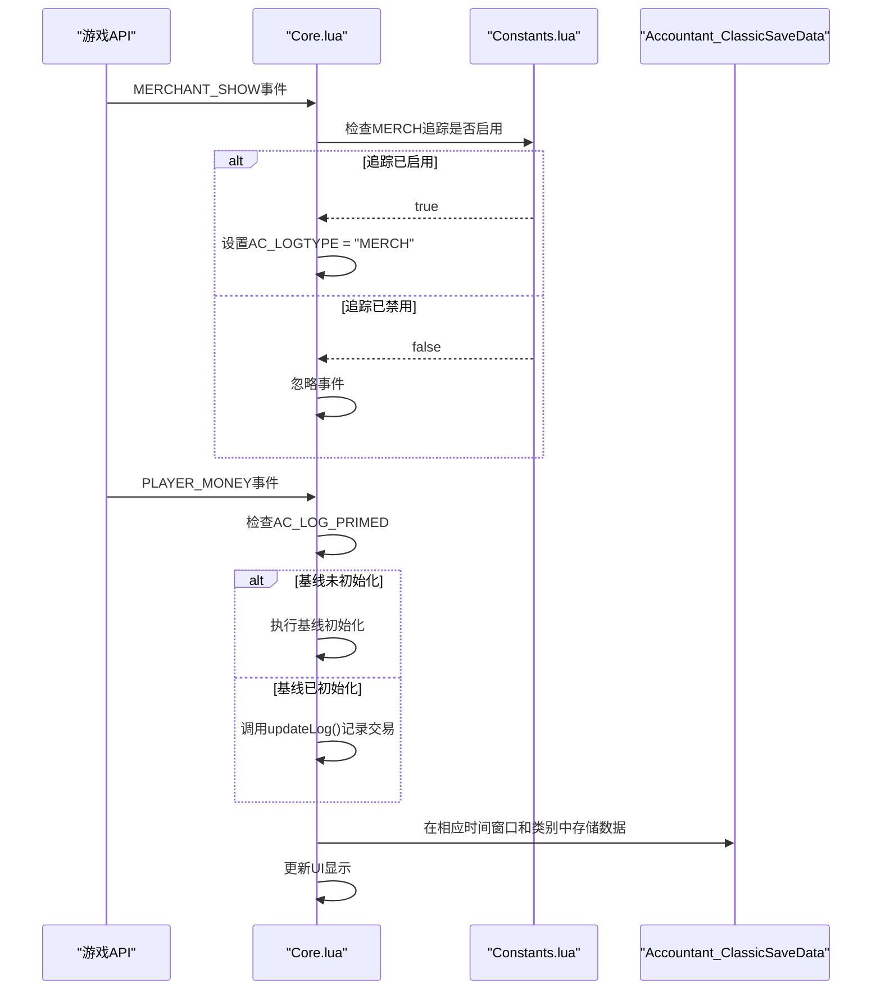
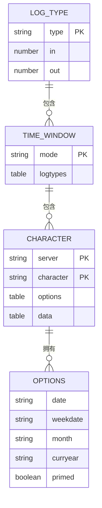
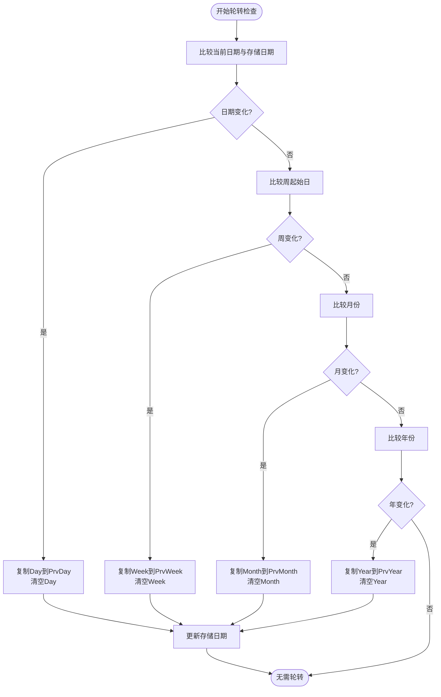
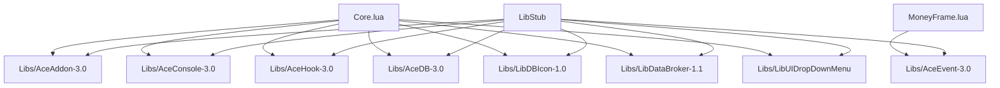

# 时间窗口

<cite>
**本文档中引用的文件**  
- [Core.lua](file://Core/Core.lua)
- [Constants.lua](file://Core/Constants.lua)
- [MoneyFrame.lua](file://Core/MoneyFrame.lua)
- [CurrencyStorage.lua](file://CurrencyTracker/CurrencyStorage.lua)
- [CurrencyFrame.lua](file://CurrencyTracker/CurrencyFrame.lua)
</cite>

## 目录
1. [简介](#简介)
2. [项目结构](#项目结构)
3. [核心组件](#核心组件)
4. [架构概述](#架构概述)
5. [详细组件分析](#详细组件分析)
6. [依赖分析](#依赖分析)
7. [性能考虑](#性能考虑)
8. [故障排除指南](#故障排除指南)
9. [结论](#结论)
10. [附录](#附录)（如有必要）

## 简介
本文档深入解析 Accountant_Classic 插件中金币数据按时间维度组织的实现方式。该插件通过会话(Session)、今日(Today)、本周(This Week)、本月(This Month)、本年(This Year)和总计(Total)六个时间窗口来追踪和管理玩家的金币收支。文档将详细阐述 `Core.lua` 中如何维护各时间窗口的数据结构，`Constants.lua` 中定义的时间周期逻辑（如周起始日、月/年边界判断），以及数据轮转机制（例如每日凌晨自动重置“今日”数据，并更新“本周”、“本月”等累计值）。同时，结合 `MoneyFrame.lua` 中的UI更新逻辑，说明用户切换时间窗口时的数据查询与渲染流程。此外，文档还将涵盖数据完整性校验和异常恢复策略。

## 项目结构
Accountant_Classic 项目采用模块化设计，核心功能主要集中在 `Core` 和 `CurrencyTracker` 两个目录下。`Core` 目录包含插件的核心逻辑，如 `Core.lua` 负责事件注册、数据初始化和主流程控制，`Constants.lua` 定义了所有常量和配置，`MoneyFrame.lua` 负责浮动信息框的UI和交互。`CurrencyTracker` 目录则专注于货币追踪功能，其数据存储和轮转逻辑与金币追踪类似，但更为复杂。这种结构清晰地分离了关注点，使得代码易于维护和扩展。

```mermaid
graph TB
subgraph "Core"
CoreLua[Core.lua]
ConstantsLua[Constants.lua]
MoneyFrameLua[MoneyFrame.lua]
end
subgraph "CurrencyTracker"
CurrencyStorageLua[CurrencyStorage.lua]
CurrencyFrameLua[CurrencyFrame.lua]
end
CoreLua --> ConstantsLua : "使用常量"
CoreLua --> MoneyFrameLua : "协调UI"
CurrencyStorageLua --> CoreLua : "共享数据结构"
CurrencyFrameLua --> CurrencyStorageLua : "查询数据"
```

**图示来源**
- [Core.lua](file://Core/Core.lua#L1-L2306)
- [Constants.lua](file://Core/Constants.lua#L1-L261)
- [MoneyFrame.lua](file://Core/MoneyFrame.lua#L1-L169)
- [CurrencyStorage.lua](file://CurrencyTracker/CurrencyStorage.lua#L1-L1222)
- [CurrencyFrame.lua](file://CurrencyTracker/CurrencyFrame.lua#L1-L1220)

**本节来源**
- [Core.lua](file://Core/Core.lua#L1-L2306)
- [Constants.lua](file://Core/Constants.lua#L1-L261)

## 核心组件
`Core.lua` 是插件的核心，它初始化插件、注册事件并包含处理财务数据的主要逻辑。`Constants.lua` 作为中央配置库，定义了所有交易类别、时间周期和UI常量。`MoneyFrame.lua` 实现了一个独立的浮动显示模块，用于展示当前会话的财务信息。这三个文件共同构成了插件的基础，确保了数据的一致性和UI的稳定性。

**本节来源**
- [Core.lua](file://Core/Core.lua#L1-L2306)
- [Constants.lua](file://Core/Constants.lua#L1-L261)
- [MoneyFrame.lua](file://Core/MoneyFrame.lua#L1-L169)

## 架构概述
Accountant_Classic 的架构遵循事件驱动模式。`Core.lua` 作为中央枢纽，通过 AceEvent-3.0 库注册监听一系列与金钱相关的游戏事件（如 `MERCHANT_SHOW`, `PLAYER_MONEY`）。当事件触发时，`Core.lua` 根据事件类型设置一个全局变量 `AC_LOGTYPE` 来标记交易类别。随后，当 `PLAYER_MONEY` 事件发生时，插件会根据 `AC_LOGTYPE` 的值将金钱变化记录到对应的时间窗口和类别中。`Constants.lua` 提供了所有必要的常量，而 `MoneyFrame.lua` 作为一个独立的 AceGUI 模块，负责显示和更新UI。



**图示来源**
- [Core.lua](file://Core/Core.lua#L1482-L1551)
- [Constants.lua](file://Core/Constants.lua#L70-L100)

## 详细组件分析
本节将深入分析实现时间窗口功能的关键组件，包括数据结构、轮转机制和UI交互。

### 时间窗口数据结构与初始化
插件使用一个嵌套的表结构来组织数据。在 `Constants.lua` 中，`constants.logmodes` 定义了所有时间模式，包括 `"Session"`, `"Day"`, `"Week"`, `"Month"`, `"Year"`, `"Total"` 及其对应的“上一”周期。`Core.lua` 在 `initOptions()` 函数中初始化 `Accountant_ClassicSaveData` 表，为每个角色创建包含 `options` 和 `data` 的条目。`data` 表的每一项对应一个 `logmode`，而每个 `logmode` 又包含所有 `logtypes` 的收支记录。



**图示来源**
- [Constants.lua](file://Core/Constants.lua#L100-L130)
- [Core.lua](file://Core/Core.lua#L265-L310)

**本节来源**
- [Constants.lua](file://Core/Constants.lua#L1-L261)
- [Core.lua](file://Core/Core.lua#L1-L2306)

### 数据轮转机制
数据轮转是确保时间窗口数据准确性的关键。该机制在 `Core.lua` 的 `addon:OnEvent` 函数中被触发，通常在 `PLAYER_LOGIN` 或 `PLAYER_MONEY` 事件时检查。它通过比较当前日期与存储在 `options` 中的 `date`, `weekdate`, `month`, `curryear` 来判断是否需要轮转。

- **每日轮转**: 当 `date` 发生变化时，将 `"Day"` 的数据复制到 `"PrvDay"`，然后清空 `"Day"`。
- **每周轮转**: 当 `weekdate` 发生变化时，将 `"Week"` 的数据复制到 `"PrvWeek"`，然后清空 `"Week"`。
- **每月轮转**: 当 `month` 发生变化时，将 `"Month"` 的数据复制到 `"PrvMonth"`，然后清空 `"Month"`。
- **每年轮转**: 当 `curryear` 发生变化时，将 `"Year"` 的数据复制到 `"PrvYear"`，然后清空 `"Year"`。

`CurrencyTracker` 模块中的 `CurrencyStorage.lua` 实现了完全相同的逻辑，通过 `Storage:ShiftCurrencyLogs()` 函数进行轮转，确保了代码的一致性。



**图示来源**
- [Core.lua](file://Core/Core.lua#L858-L878)
- [Core.lua](file://Core/Core.lua#L908-L932)
- [Core.lua](file://Core/Core.lua#L990-L1011)
- [CurrencyStorage.lua](file://CurrencyTracker/CurrencyStorage.lua#L360-L434)

**本节来源**
- [Core.lua](file://Core/Core.lua#L858-L1011)
- [CurrencyStorage.lua](file://CurrencyTracker/CurrencyStorage.lua#L323-L434)

### UI更新与用户交互
`MoneyFrame.lua` 负责管理一个浮动的UI元素，显示当前会话的金币信息。当用户在主界面切换时间窗口时，`Core.lua` 会更新 `AC_CURRTAB` 并调用 `setLabels()` 和 `AccountantClassic_OnShow()` 来刷新UI。`MoneyFrame` 模块通过 `frame_OnUpdate` 函数持续监控玩家的金币数量，并在发生变化时更新其显示。`CurrencyTracker` 的 `CurrencyFrame.lua` 实现了更复杂的UI，它使用 `timeframeMap` 将UI标签映射到内部的时间段，并通过 `RefreshView()` 函数根据当前选择的时间窗口和货币来查询和渲染数据。

**本节来源**
- [MoneyFrame.lua](file://Core/MoneyFrame.lua#L1-L169)
- [CurrencyFrame.lua](file://CurrencyTracker/CurrencyFrame.lua#L979-L1034)

## 依赖分析
Accountant_Classic 依赖于多个外部库来实现其功能。`AceAddon-3.0` 提供了插件的生命周期管理，`AceEvent-3.0` 用于事件处理，`AceDB-3.0` 用于配置管理，`LibDBIcon-1.0` 用于在小地图上创建按钮，`LibDataBroker-1.1` 用于数据共享。这些库通过 `LibStub` 被加载和使用，确保了插件的稳定性和与其他插件的兼容性。



**图示来源**
- [Core.lua](file://Core/Core.lua#L30-L35)
- [MoneyFrame.lua](file://Core/MoneyFrame.lua#L20-L25)

**本节来源**
- [Core.lua](file://Core/Core.lua#L1-L2306)
- [Libs](file://Libs)

## 性能考虑
插件在性能方面做了多项优化。`MoneyFrame` 的 `OnUpdate` 函数仅在金币数量实际发生变化时才更新UI，避免了不必要的渲染。数据轮转逻辑通过比较日期字符串来避免频繁的计算。使用 AceAddon-3.0 和 AceEvent-3.0 等成熟的库，可以确保事件处理的高效性。此外，`CurrencyTracker` 模块的 `ShiftCurrencyLogs` 函数在每次检查时都会先判断是否需要轮转，避免了无谓的复制操作。

## 故障排除指南
- **数据未记录**: 检查 `AC_LOG_PRIMED` 是否为 `true`。如果为 `false`，插件可能仍在进行基线初始化。确保相关事件（如 `MERCHANT_SHOW`）已被触发。
- **时间窗口未轮转**: 检查 `options` 表中的 `date`, `weekdate`, `month`, `curryear` 是否正确更新。确认 `PLAYER_LOGIN` 事件是否被正确触发。
- **UI不更新**: 检查 `MoneyFrame` 是否已启用（`profile.showmoneyinfo`），并确认 `PLAYER_MONEY` 事件是否正常触发。
- **数据完整性问题**: `CurrencyStorage.lua` 中的 `Storage:ValidateData()` 函数提供了数据校验功能，可以检查并修复损坏的结构。

**本节来源**
- [Core.lua](file://Core/Core.lua#L265-L310)
- [CurrencyStorage.lua](file://CurrencyTracker/CurrencyStorage.lua#L852-L892)

## 结论
Accountant_Classic 通过精心设计的数据结构和事件驱动的架构，有效地实现了对金币和货币的多维度追踪。其核心的“基线初始化”和“数据轮转”机制确保了数据的准确性和连续性。模块化的代码结构和对Ace库的依赖使其稳定且易于维护。`CurrencyTracker` 模块的成功实现证明了其架构的可扩展性，能够将相同的设计模式应用于更复杂的货币追踪场景。

## 附录
### 时间窗口映射表
| UI标签 | 内部时间窗口 | 说明 |
| :--- | :--- | :--- |
| 本次 | `Session` | 当前游戏会话 |
| 今天 | `Day` | 当天的收支 |
| 昨天 | `PrvDay` | 上一天的收支 |
| 本周 | `Week` | 当周的收支 |
| 上周 | `PrvWeek` | 上一周的收支 |
| 本月 | `Month` | 当月的收支 |
| 上月 | `PrvMonth` | 上一月的收支 |
| 本年 | `Year` | 当年的收支 |
| 去年 | `PrvYear` | 上一年的收支 |
| 总计 | `Total` | 历史累计 |