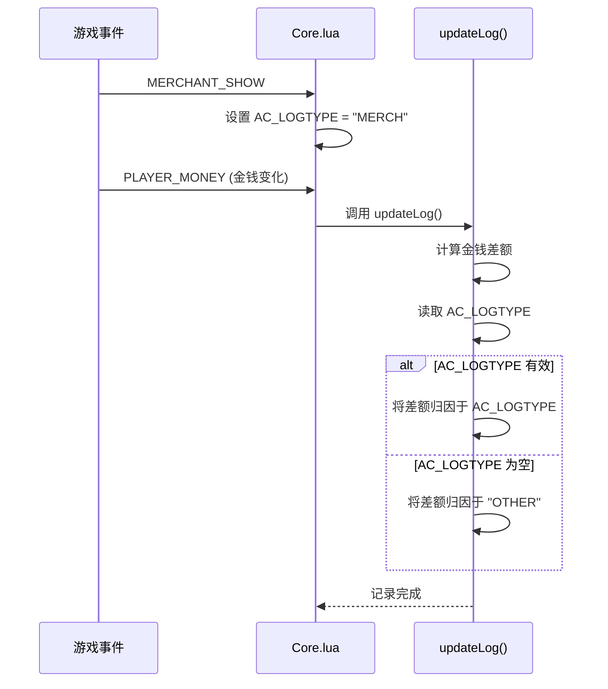

# 来源分类

<cite>
**本文档中引用的文件**
- [Constants.lua](file://Core/Constants.lua)
- [Core.lua](file://Core/Core.lua)
- [GoldTracker-Event-Classification.md](file://Docs/GoldTracker-Event-Classification.md)
</cite>

## 目录
1. [收入与支出来源常量定义](#收入与支出来源常量定义)
2. [事件监听与上下文状态管理](#事件监听与上下文状态管理)
3. [交易类型识别逻辑](#交易类型识别逻辑)
4. [新增自定义来源开发步骤](#新增自定义来源开发步骤)
5. [常见问题排查与性能优化](#常见问题排查与性能优化)

## 收入与支出来源常量定义

在 `Core/Constants.lua` 文件中，通过 `constants.logtypes` 数组定义了所有可用的收入与支出来源。这些常量作为交易分类的核心标识符，包括：`MERCH`（商人）、`REPAIRS`（修理）、`TAXI`（飞行）、`TRAIN`（训练）、`AH`（拍卖行）、`MAIL`（邮件）、`QUEST`（任务）、`LOOT`（拾取）和 `OTHER`（其他）。每个常量都与一个本地化的标题（如 `L["Merchants"]`）在 `constants.onlineData` 表中进行映射，用于在用户界面中显示。该机制确保了分类的可扩展性和多语言支持。

**Section sources**
- [Constants.lua](file://Core/Constants.lua#L198-L259)

## 事件监听与上下文状态管理

插件通过 `Core.lua` 中的 `AccountantClassic_RegisterEvents` 函数注册一系列游戏事件，如 `MERCHANT_SHOW`、`TAXIMAP_OPENED` 和 `MAIL_INBOX_UPDATE` 等。当这些事件触发时，`AccountantClassic_OnEvent` 函数会根据事件类型设置一个全局的上下文变量 `AC_LOGTYPE`。例如，当 `MERCHANT_SHOW` 事件发生时，`AC_LOGTYPE` 被设为 `"MERCH"`；当 `TRAINER_SHOW` 事件发生时，则被设为 `"TRAIN"`。这个变量充当了当前交易类型的“状态标志”，其值会一直保持（具有“黏性”），直到被另一个事件覆盖或被显式清空，从而确保了即使在界面关闭后发生的金钱变动也能被正确归因。

**Section sources**
- [Core.lua](file://Core/Core.lua#L1084-L1558)

## 交易类型识别逻辑

交易类型的最终识别发生在 `PLAYER_MONEY` 事件中。当玩家的金钱发生变化时，系统会调用 `updateLog()` 函数。此函数首先计算当前与上一次记录的金钱差额，然后检查 `AC_LOGTYPE` 的当前值。如果 `AC_LOGTYPE` 不为空，该差额将被归因于该类别；如果 `AC_LOGTYPE` 为空（例如，没有触发任何相关事件），则默认归因于 `OTHER` 类别。对于 `MAIL_INBOX_UPDATE` 这类需要进一步判断的事件，插件会调用 `AccountantClassic_DetectAhMail()` 函数，通过检查邮件发票类型来区分是普通邮件 (`MAIL`) 还是拍卖行收入 (`AH`)。此外，像 `REPAIRS` 这样的特殊类别，是在 `MERCHANT_UPDATE` 事件中通过 `InRepairMode()` 函数检测到修理模式时，临时将 `AC_LOGTYPE` 从 `"MERCH"` 切换为 `"REPAIRS"` 来实现的。

**Diagram sources**
- [Core.lua](file://Core/Core.lua#L1084-L1558)

## 新增自定义来源开发步骤

要新增一个自定义来源，首先需要在 `Core/Constants.lua` 中的 `constants.logtypes` 数组里添加新的常量（例如 `"CUSTOM"`），并在 `constants.onlineData` 表中为其定义一个标题。其次，在 `Core.lua` 的事件监听列表中，找到或添加一个能触发该交易的事件（如 `CUSTOM_EVENT`），并在 `AccountantClassic_OnEvent` 函数中添加一个分支，当该事件发生时将 `AC_LOGTYPE` 设置为新定义的常量。最后，确保数据记录逻辑（`updateLog`）能够处理这个新类别。开发时应参考现有模式，确保事件的触发条件和上下文设置的准确性。

**Section sources**
- [Constants.lua](file://Core/Constants.lua#L198-L259)
- [Core.lua](file://Core/Core.lua#L1084-L1558)

## 常见问题排查与性能优化

**来源误判排查**：最常见的误判源于事件监听的时机问题。例如，`TAXIMAP_CLOSED` 事件被注释掉不清空 `AC_LOGTYPE`，是因为飞行费用的扣除可能在地图关闭后才发生。排查时，应检查相关事件的触发顺序和 `AC_LOGTYPE` 的生命周期。使用 `/accountant verbose` 命令可以开启详细日志，实时查看 `AC_LOGTYPE` 的变化和金钱变动的归因过程，这是诊断问题的关键工具。

**性能优化建议**：插件已通过多种方式优化性能。`MoneyFrame` 模块通过 `OnUpdate` 脚本仅在金钱实际变化时才更新UI，避免了不必要的刷新。事件处理逻辑集中且高效，避免了复杂的计算。对于未来扩展，应优先考虑使用数据驱动的分类规则，而非在 `AccountantClassic_OnEvent` 中添加大量 `if-else` 分支，以保持代码的可维护性和性能。

**Section sources**
- [Core.lua](file://Core/Core.lua#L1084-L1558)
- [GoldTracker-Event-Classification.md](file://Docs/GoldTracker-Event-Classification.md#L79-L83)