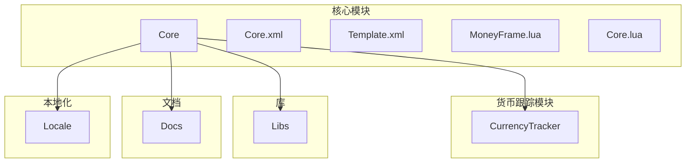
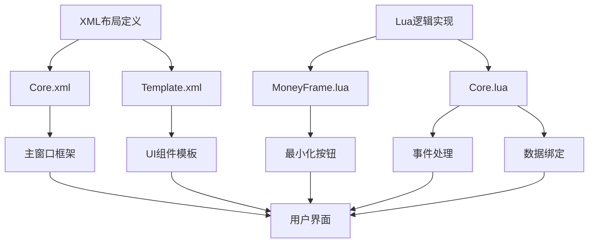
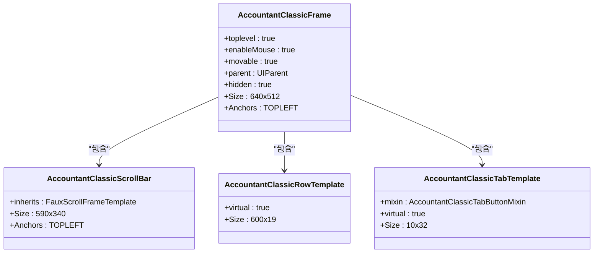
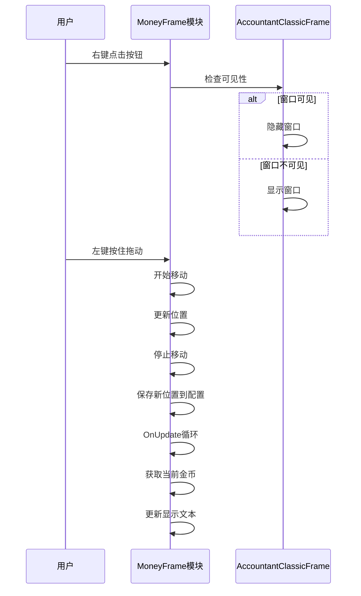
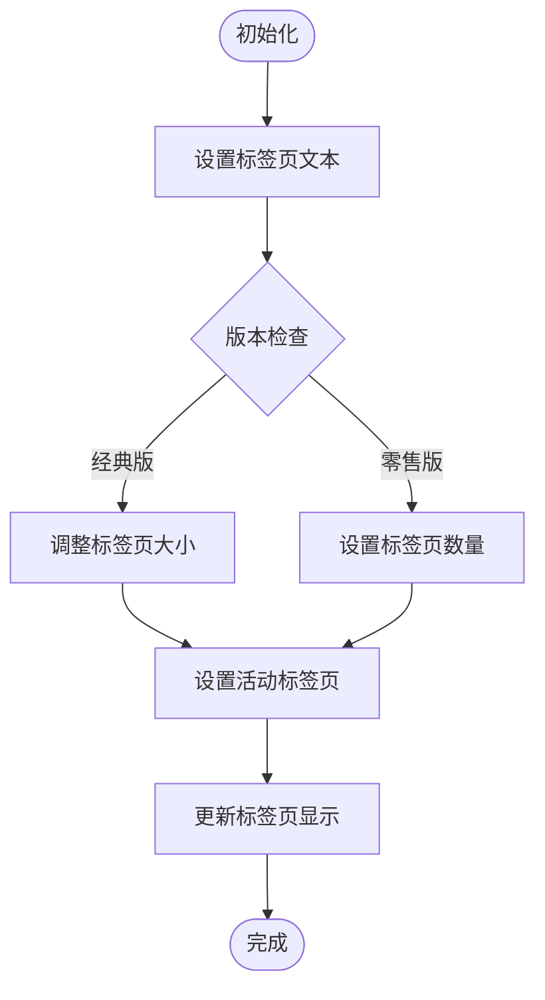
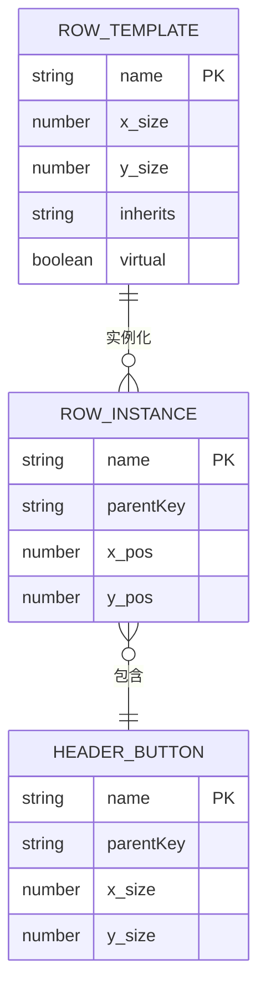
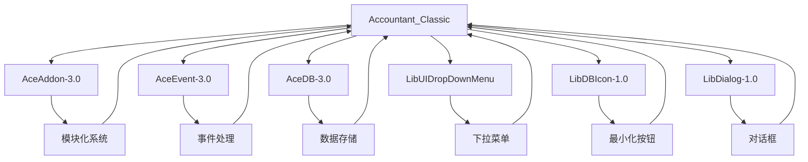

# 用户界面

<cite>
**本文档引用的文件**
- [Core.xml](file://Core/Core.xml)
- [Template.xml](file://Core/Template.xml)
- [MoneyFrame.lua](file://Core/MoneyFrame.lua)
- [Core.lua](file://Core/Core.lua)
</cite>

## 目录
1. [简介](#简介)
2. [项目结构](#项目结构)
3. [核心组件](#核心组件)
4. [架构概述](#架构概述)
5. [详细组件分析](#详细组件分析)
6. [依赖分析](#依赖分析)
7. [性能考虑](#性能考虑)
8. [故障排除指南](#故障排除指南)
9. [结论](#结论)
10. [附录](#附录)（如有必要）

## 简介
本文档全面记录了金币跟踪模块的用户界面组件，重点描述了MoneyFrame主窗口的布局结构、控件组成和交互行为。基于Core.xml和Template.xml中的XML定义，解析框架、滚动区域、标签页和表格控件的组织方式。结合MoneyFrame.lua中的Lua逻辑，说明窗口创建、显示/隐藏控制、位置记忆和缩放功能的实现。阐述Core.lua如何将数据绑定到UI元素，并响应用户操作（如点击表头排序）。说明最小化地图按钮与主窗口的联动机制。提供UI定制指南，包括如何修改主题、调整透明度和扩展布局。包含常见UI问题（如窗口错位、无法拖动）的诊断与修复方法。

## 项目结构
项目结构包含核心模块、货币跟踪模块、文档、库和本地化文件。核心模块（Core）包含主要的UI定义和逻辑实现，其中Core.xml和Template.xml定义了UI布局，MoneyFrame.lua处理最小化按钮的逻辑，Core.lua管理主窗口的交互和数据绑定。

**图示来源**
- [Core.xml](file://Core/Core.xml#L1-L627)
- [Template.xml](file://Core/Template.xml#L1-L180)

**章节来源**
- [Core.xml](file://Core/Core.xml#L1-L627)
- [Template.xml](file://Core/Template.xml#L1-L180)

## 核心组件
核心组件包括主窗口框架AccountantClassicFrame、标签页系统、滚动区域和最小化按钮。主窗口由Core.xml定义，包含18个数据行、11个标签页和一个可拖动的最小化按钮。Template.xml定义了行模板和标签页模板，实现了UI组件的复用。

**章节来源**
- [Core.xml](file://Core/Core.xml#L1-L627)
- [Template.xml](file://Core/Template.xml#L1-L180)

## 架构概述
系统架构采用分层设计，XML文件定义UI布局和结构，Lua文件处理逻辑和交互。Core.xml定义主窗口的框架、控件布局和初始状态，Template.xml提供可复用的UI组件模板，MoneyFrame.lua实现最小化按钮的功能，Core.lua管理主窗口的事件处理和数据绑定。

**图示来源**
- [Core.xml](file://Core/Core.xml#L1-L627)
- [Template.xml](file://Core/Template.xml#L1-L180)
- [MoneyFrame.lua](file://Core/MoneyFrame.lua#L1-L169)
- [Core.lua](file://Core/Core.lua#L1-L2335)

## 详细组件分析

### 主窗口框架分析
主窗口框架AccountantClassicFrame在Core.xml中定义，是一个可移动、可调整大小的顶级窗口。窗口大小为640x512像素，初始位置在屏幕左上角下方104像素处。窗口包含标题、数据行、滚动条、关闭按钮、退出按钮、选项按钮、重置按钮和最小化按钮。

**图示来源**
- [Core.xml](file://Core/Core.xml#L1-L627)

**章节来源**
- [Core.xml](file://Core/Core.xml#L1-L627)

### 最小化按钮分析
最小化按钮在MoneyFrame.lua中实现，是一个可拖动的框架，显示当前金币数量。按钮通过createMoneyFrame函数创建，支持左键拖动移动位置，右键点击打开主窗口。按钮位置和状态由配置文件持久化存储。

**图示来源**
- [MoneyFrame.lua](file://Core/MoneyFrame.lua#L1-L169)

**章节来源**
- [MoneyFrame.lua](file://Core/MoneyFrame.lua#L1-L169)

### 标签页系统分析
标签页系统在Core.xml中定义，包含11个标签页按钮，使用AccountantClassicTabTemplate模板。标签页用于切换不同的数据视图，如会话、天、周、月等。Core.lua中的settleTabText函数负责设置标签页文本和布局。

**图示来源**
- [Core.xml](file://Core/Core.xml#L1-L627)
- [Core.lua](file://Core/Core.lua#L1-L2335)

**章节来源**
- [Core.xml](file://Core/Core.xml#L1-L627)
- [Core.lua](file://Core/Core.lua#L1-L2335)

### 数据表格分析
数据表格由18个行框架组成，每个行框架包含三个按钮：标题、收入和支出。行框架继承自AccountantClassicRowTemplate模板，确保一致的布局和样式。表格数据通过滚动条控件AccountantClassicScrollBar管理。

**图示来源**
- [Template.xml](file://Core/Template.xml#L1-L180)
- [Core.xml](file://Core/Core.xml#L1-L627)

**章节来源**
- [Template.xml](file://Core/Template.xml#L1-L180)
- [Core.xml](file://Core/Core.xml#L1-L627)

## 依赖分析
系统依赖于多个外部库和框架，包括AceAddon-3.0、AceEvent-3.0、LibUIDropDownMenu和LibDBIcon-1.0。这些库提供了模块化、事件处理、下拉菜单和最小化按钮图标的功能。核心模块依赖于这些库来实现其功能，同时保持代码的模块化和可维护性。

**图示来源**
- [Core.lua](file://Core/Core.lua#L1-L2335)
- [Libs.xml](file://Libs/Libs.xml#L1-L100)

**章节来源**
- [Core.lua](file://Core/Core.lua#L1-L2335)
- [Libs.xml](file://Libs/Libs.xml#L1-L100)

## 性能考虑
UI性能主要受窗口大小、控件数量和更新频率的影响。主窗口包含大量控件，但通过合理的布局和事件处理机制，确保了良好的性能表现。最小化按钮使用OnUpdate循环更新金币显示，但通过缓存机制减少不必要的更新。建议用户根据需要调整窗口大小和透明度，以平衡功能性和性能。

## 故障排除指南
常见UI问题包括窗口错位、无法拖动和显示异常。对于窗口错位问题，可以重置窗口位置配置。对于无法拖动问题，检查是否在战斗中或被其他插件阻止。对于显示异常问题，尝试重新加载UI或检查配置文件。

**章节来源**
- [MoneyFrame.lua](file://Core/MoneyFrame.lua#L1-L169)
- [Core.lua](file://Core/Core.lua#L1-L2335)

## 结论
金币跟踪模块的用户界面设计合理，功能完整。通过XML和Lua的分离设计，实现了UI布局和逻辑的解耦。主窗口提供了丰富的数据视图，最小化按钮提供了便捷的访问方式。系统具有良好的扩展性和可维护性，为用户提供了直观的金币管理体验。