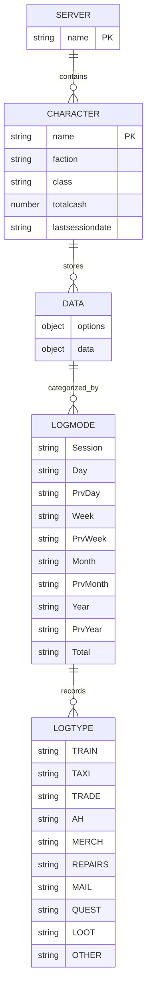
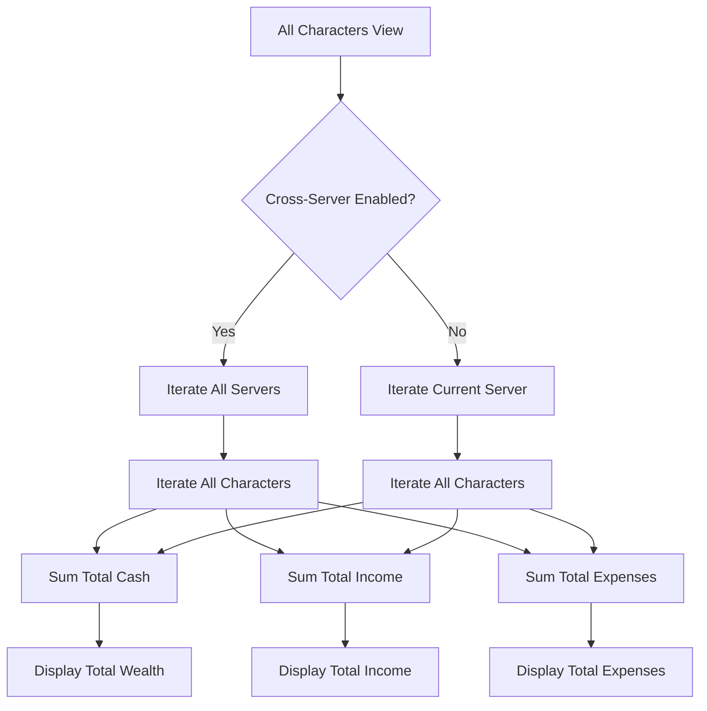
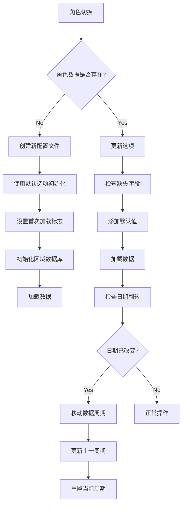

# 跨角色概览

<cite>
**本文档引用的文件**  
- [Core.lua](file://Core/Core.lua)
- [Constants.lua](file://Core/Constants.lua)
- [Config.lua](file://Core/Config.lua)
- [Accountant_ClassicSaveData](file://Data Model/Data Model.md)
- [Saved Variables Schema.md](file://Data Model/Saved Variables Schema.md)
</cite>

## 目录
1. [简介](#简介)
2. [数据结构与组织](#数据结构与组织)
3. [跨角色数据聚合算法](#跨角色数据聚合算法)
4. [角色切换与数据加载机制](#角色切换与数据加载机制)
5. [配置选项与数据追踪控制](#配置选项与数据追踪控制)
6. [性能优化策略](#性能优化策略)
7. [数据冲突与同步异常处理](#数据冲突与同步异常处理)
8. [结论](#结论)

## 简介
Accountant_Classic 是一款用于追踪《魔兽世界》中角色金币收支的插件。其核心功能之一是提供跨角色和跨服务器的金币数据汇总视图，使玩家能够全面了解其所有角色的财务状况。本文档详细阐述了该功能的实现原理，包括数据存储结构、聚合算法、加载机制、配置选项以及性能优化策略。

**Section sources**
- [Core.lua](file://Core/Core.lua#L1-L50)
- [Constants.lua](file://Core/Constants.lua#L1-L20)

## 数据结构与组织
Accountant_Classic 使用 `Accountant_ClassicSaveData` 作为其核心数据结构，该结构以服务器和角色名称为层级进行组织，实现了数据的隔离与高效检索。

### Accountant_ClassicSaveData 结构
`Accountant_ClassicSaveData` 是一个嵌套的 Lua 表，其层级结构如下：
- **服务器层 (Server Level)**: 以服务器名称（如 "Hyjal"）作为顶级键。
- **角色层 (Character Level)**: 在服务器层下，以角色名称（如 "Kamus"）作为次级键。
- **数据层 (Data Level)**: 包含 `options` 和 `data` 两个主要部分。



**Diagram sources**
- [Core.lua](file://Core/Core.lua#L262-L304)
- [Constants.lua](file://Core/Constants.lua#L50-L52)

### 选项结构 (Options Structure)
`options` 表存储了角色特定的配置和元数据，其关键字段定义如下：
- :version: 插件版本字符串。
- :date: 当前日期，格式为 "dd/mm/yy"。
- :lastsessiondate: 上次会话的日期。
- :weekdate: 当前周的起始日期。
- :month: 当前月份 (1-12)。
- :curryear: 当前年份。
- :totalcash: 角色当前拥有的金币总额。
- :faction: 角色的阵营（如 "Alliance"）。
- :class: 角色的职业。

### 交易数据结构 (Transaction Data Structure)
`data` 表存储了按类型和时间段分类的财务交易记录。交易按 `logmodes`（如 "Session", "Day", "Week"）和 `logtypes`（如 "TRAIN", "TAXI", "QUEST"）进行分类，每个分类包含 "In"（收入）和 "Out"（支出）两个数值。

**Section sources**
- [Core.lua](file://Core/Core.lua#L100-L115)
- [Constants.lua](file://Core/Constants.lua#L20-L45)

## 跨角色数据聚合算法
跨角色数据汇总功能的核心是数据聚合算法，该算法能够遍历所有角色记录，并根据时间窗口和来源进行合并计算。

### 聚合流程
当用户在主界面选择 "All Chars" 标签页时，系统会执行以下聚合流程：



**Diagram sources**
- [Core.lua](file://Core/Core.lua#L1739-L1798)

### 聚合实现
聚合算法在 `Core.lua` 的 `AccountantClassic_OnShow` 函数中实现。其核心逻辑如下：
1. **初始化累加器**: 初始化 `alltotal`, `allin`, `allout` 等变量用于累加总和。
2. **遍历服务器**: 根据 `profile.cross_server` 配置，决定是遍历所有服务器还是仅当前服务器。
3. **遍历角色**: 对于每个服务器，遍历其下的所有角色。
4. **应用阵营过滤**: 如果用户选择了特定阵营，则只累加该阵营角色的数据。
5. **累加数据**: 将每个角色的 `totalcash`、`Total` 模式的收入和支出累加到总和中。

```lua
-- 伪代码示例
for serverkey, servervalue in pairs(Accountant_ClassicSaveData) do
    for charkey, charvalue in pairs(Accountant_ClassicSaveData[serverkey]) do
        if (满足阵营过滤条件) then
            alltotal = alltotal + charvalue.options.totalcash
            allin = allin + charvalue.data[key].Total.In
            allout = allout + charvalue.data[key].Total.Out
        end
    end
end
```

**Section sources**
- [Core.lua](file://Core/Core.lua#L1768-L1787)

## 角色切换与数据加载机制
当用户在不同角色间切换时，系统会动态加载对应角色的数据，并更新界面显示。

### 数据加载流程
数据加载机制确保了角色切换时的流畅体验：



**Diagram sources**
- [Core.lua](file://Core/Core.lua#L262-L304)
- [Core.lua](file://Core/Core.lua#L849-L983)

### 缓存策略
系统通过以下方式实现缓存：
- **内存缓存**: 将当前角色的数据加载到 `AC_DATA` 表中，避免每次界面更新都从 `SavedVariables` 读取。
- **惰性加载**: 仅在需要时（如打开界面或切换角色）才执行数据加载和聚合操作。
- **增量更新**: 当发生新的金钱变动时，只更新受影响的 `AC_DATA` 条目，而不是重新加载整个数据集。

**Section sources**
- [Core.lua](file://Core/Core.lua#L1013-L1049)

## 配置选项与数据追踪控制
用户可以通过配置选项来启用或禁用特定角色的数据追踪。

### 配置选项
`Constants.lua` 文件中的 `constants.defaults` 定义了默认配置，其中与数据追踪相关的选项包括：
- :cross_server: 布尔值，控制是否显示所有服务器的角色信息。
- :show_allFactions: 布尔值，控制是否显示所有阵营的角色信息。
- :trackzone: 布尔值，控制是否追踪每笔收支的发生地点。

这些选项在 `Config.lua` 中通过 AceConfig 框架暴露给用户，用户可以在游戏内界面进行修改。

### 启用/禁用追踪
用户无法直接“禁用”某个角色的数据追踪，但可以通过以下方式间接控制：
- **删除角色数据**: 在配置界面中选择一个角色并删除其数据，这将从 `Accountant_ClassicSaveData` 中移除该角色的条目。
- **过滤显示**: 通过 `cross_server` 和 `show_allFactions` 选项，可以过滤掉不想看到的角色数据。

**Section sources**
- [Constants.lua](file://Core/Constants.lua#L20-L45)
- [Config.lua](file://Core/Config.lua#L1-L50)

## 性能优化策略
为了减少内存占用和加快加载速度，系统采用了多种性能优化策略。

### 内存优化
- **数据结构扁平化**: `AC_DATA` 表在内存中被设计为扁平结构，便于快速访问。
- **按需加载**: 仅在需要时才将 `SavedVariables` 中的数据加载到内存。
- **避免冗余存储**: `Accountant_Classic_CurrencyDB` 结构被设计为账户范围的全局存储，避免了在每个角色上重复存储货币发现信息。

### 加载速度优化
- **高效的遍历算法**: 使用 `pairs` 和 `orderedpairs` 函数进行高效的数据遍历。
- **减少 I/O 操作**: 将数据聚合和计算操作集中在一次界面更新中完成，而不是在每次事件发生时都进行。
- **预计算**: 在角色登录时，预先计算好 `PrvDay`, `PrvWeek` 等周期的数据，避免在界面显示时进行耗时计算。

**Section sources**
- [Core.lua](file://Core/Core.lua#L1652-L1675)
- [CurrencyStorage.lua](file://CurrencyTracker/CurrencyStorage.lua#L491-L520)

## 数据冲突与同步异常处理
系统需要处理如同名角色和同步异常等数据冲突问题。

### 同名角色处理
由于 `Accountant_ClassicSaveData` 的结构是 `Server -> Character -> Data`，即使不同服务器上有同名角色，它们的数据也会被存储在不同的路径下，因此不会发生冲突。例如：
- `Accountant_ClassicSaveData["ServerA"]["Kamus"]`
- `Accountant_ClassicSaveData["ServerB"]["Kamus"]`

### 同步异常排查
- **数据初始化**: 确保 `initOptions` 函数正确处理了新角色和旧配置文件的兼容性。
- **事件处理**: 通过 `PLAYER_LOGIN` 事件确保基线初始化只执行一次，防止数据重复计算。
- **错误日志**: 在 `CurrencyStorage.lua` 中，`ValidateData` 函数会检查数据完整性，并在发现无效结构时记录错误日志。

**Section sources**
- [Core.lua](file://Core/Core.lua#L265-L310)
- [CurrencyStorage.lua](file://CurrencyTracker/CurrencyStorage.lua#L813-L850)

## 结论
Accountant_Classic 通过精心设计的 `Accountant_ClassicSaveData` 数据结构和高效的聚合算法，成功实现了跨角色和跨服务器的金币数据汇总功能。其数据加载机制和缓存策略保证了良好的性能，而丰富的配置选项则为用户提供了灵活的控制能力。通过遵循本文档的原理，开发者可以更好地理解和维护这一功能。