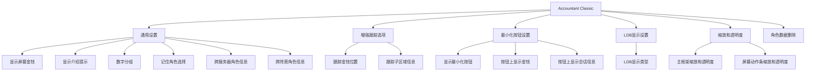
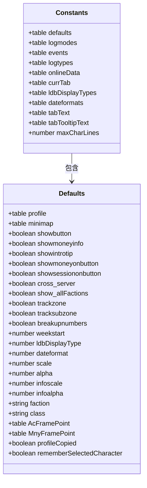
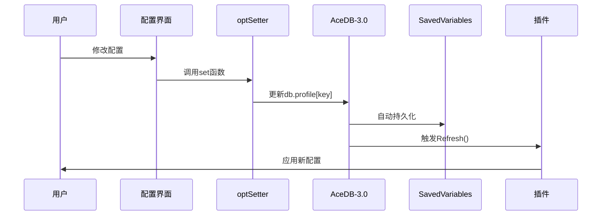

# 配置选项

<cite>
**本文档中引用的文件**   
- [Config.lua](file://Core/Config.lua)
- [Constants.lua](file://Core/Constants.lua)
- [Core.lua](file://Core/Core.lua)
</cite>

## 目录
1. [简介](#简介)
2. [配置树结构](#配置树结构)
3. [通用设置](#通用设置)
4. [增强跟踪选项](#增强跟踪选项)
5. [UI显示设置](#ui显示设置)
6. [最小化按钮行为](#最小化按钮行为)
7. DEFAULTS表结构与AceDB-3.0集成
8. [配置值的读取、更新和持久化流程](#配置值的读取更新和持久化流程)
9. [开发者指南](#开发者指南)
10. [最佳实践](#最佳实践)

## 简介
Accountant_Classic插件通过AceConfig-3.0框架提供了全面的配置系统，允许用户自定义金币跟踪模块的行为。该系统基于AceDB-3.0实现配置的持久化存储，支持多种配置选项，包括通用设置、增强跟踪、UI显示和最小化按钮行为。配置系统采用模块化设计，便于扩展和维护。

**Section sources**
- [Config.lua](file://Core/Config.lua#L1-L430)
- [Constants.lua](file://Core/Constants.lua#L1-L260)

## 配置树结构
配置系统通过AceConfig-3.0构建了一个层次化的配置树，根节点为插件名称，包含多个子组。配置树的结构设计遵循功能分组原则，将相关配置项组织在一起。

**Diagram sources**
- [Config.lua](file://Core/Config.lua#L50-L430)

**Section sources**
- [Config.lua](file://Core/Config.lua#L50-L430)

## 通用设置
通用设置组包含影响插件整体行为的基本配置选项。

### 显示屏幕金钱
控制是否在屏幕上显示浮动金钱信息框。

**Section sources**
- [Config.lua](file://Core/Config.lua#L100-L110)

### 重置位置
提供一个执行按钮，用于将金钱信息框的位置重置到默认位置。

**Section sources**
- [Config.lua](file://Core/Config.lua#L111-L118)

### 显示介绍提示
控制是否显示最小化按钮或浮动金钱框的操作提示。

**Section sources**
- [Config.lua](file://Core/Config.lua#L119-L125)

### 数字分组
控制是否将数字转换为本地化字符串，并按需分组数字。

**Section sources**
- [Config.lua](file://Core/Config.lua#L126-L131)

### 记住角色选择
控制是否记住下拉菜单中的最新角色选择。

**Section sources**
- [Config.lua](file://Core/Config.lua#L132-L140)

### 跨服务器角色信息
控制是否显示所有服务器角色的金钱信息。

**Section sources**
- [Config.lua](file://Core/Config.lua#L141-L150)

### 跨阵营角色信息
控制是否显示所有阵营角色的金钱信息。

**Section sources**
- [Config.lua](file://Core/Config.lua#L151-L160)

## 增强跟踪选项
增强跟踪选项组包含更高级的跟踪功能配置。

### 跟踪金钱位置
启用后，跟踪每笔收入/支出的地理位置，并在鼠标悬停时显示细分信息。

**Section sources**
- [Config.lua](file://Core/Config.lua#L161-L168)

### 跟踪子区域信息
在启用位置跟踪的基础上，进一步跟踪子区域信息。

**Section sources**
- [Config.lua](file://Core/Config.lua#L169-L175)

## UI显示设置
UI显示设置组包含控制界面外观的配置选项。

### 主框架缩放和透明度
控制Accountant Classic主框架的缩放比例和透明度。

**Section sources**
- [Config.lua](file://Core/Config.lua#L185-L195)

### 屏幕动作条缩放和透明度
控制屏幕动作条上金钱信息的缩放比例和透明度。

**Section sources**
- [Config.lua](file://Core/Config.lua#L196-L206)

## 最小化按钮行为
控制最小化按钮的行为和显示内容。

### 显示最小化按钮
控制是否显示最小化按钮。

**Section sources**
- [Config.lua](file://Core/Config.lua#L207-L214)

### 按钮上显示金钱
控制是否在最小化按钮的工具提示中显示金钱信息。

**Section sources**
- [Config.lua](file://Core/Config.lua#L215-L221)

### 按钮上显示会话信息
控制是否在最小化按钮的工具提示中显示会话信息。

**Section sources**
- [Config.lua](file://Core/Config.lua#L222-L228)

## DEFAULTS表结构与AceDB-3.0集成
Constants.lua中的DEFAULTS表定义了插件的默认配置，与AceDB-3.0集成实现配置的持久化管理。

**Diagram sources**
- [Constants.lua](file://Core/Constants.lua#L20-L45)

**Section sources**
- [Constants.lua](file://Core/Constants.lua#L20-L45)

## 配置值的读取、更新和持久化流程
配置系统通过AceDB-3.0实现配置值的读取、更新和持久化，确保用户设置在游戏重启后仍然有效。

**Diagram sources**
- [Config.lua](file://Core/Config.lua#L25-L35)
- [Core.lua](file://Core/Core.lua#L2259-L2334)

**Section sources**
- [Config.lua](file://Core/Config.lua#L25-L35)
- [Core.lua](file://Core/Core.lua#L2259-L2334)

## 开发者指南
本指南为开发者提供添加新配置项的详细说明。

### 定义默认值
在Constants.lua的constants.defaults表中定义新配置项的默认值。

**Section sources**
- [Constants.lua](file://Core/Constants.lua#L20-L45)

### 创建配置界面控件
在Config.lua的getOptions函数中添加新的配置项定义，指定类型、名称、描述等属性。

**Section sources**
- [Config.lua](file://Core/Config.lua#L50-L430)

### 绑定事件回调
为配置项设置getter和setter函数，或在set函数中添加自定义逻辑，如触发Refresh()更新界面。

**Section sources**
- [Config.lua](file://Core/Config.lua#L25-L35)

## 最佳实践
### 配置重置
提供重置功能，允许用户将配置恢复到默认状态。

**Section sources**
- [Config.lua](file://Core/Config.lua#L111-L118)

### 导入导出
利用AceDB-3.0的配置文件管理功能，支持配置的导入导出。

**Section sources**
- [Config.lua](file://Core/Config.lua#L50-L430)

### 多配置文件管理
支持多个配置文件，允许用户在不同角色间共享或独立配置。

**Section sources**
- [Config.lua](file://Core/Config.lua#L50-L430)