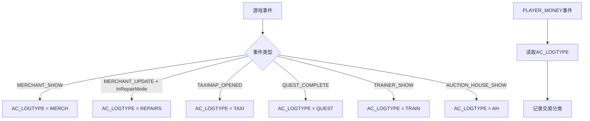
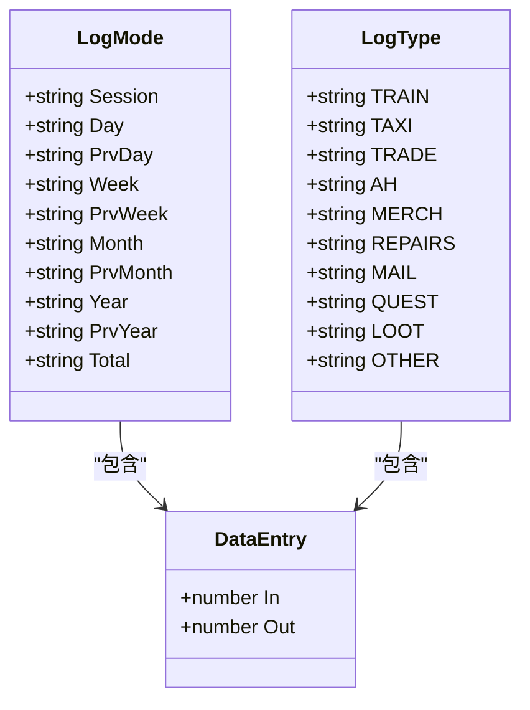
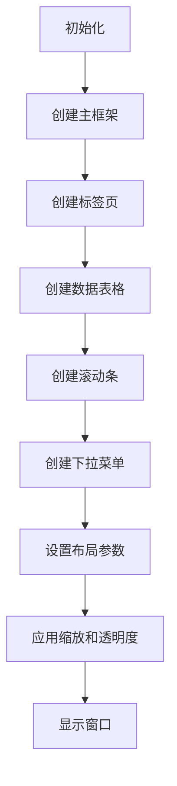
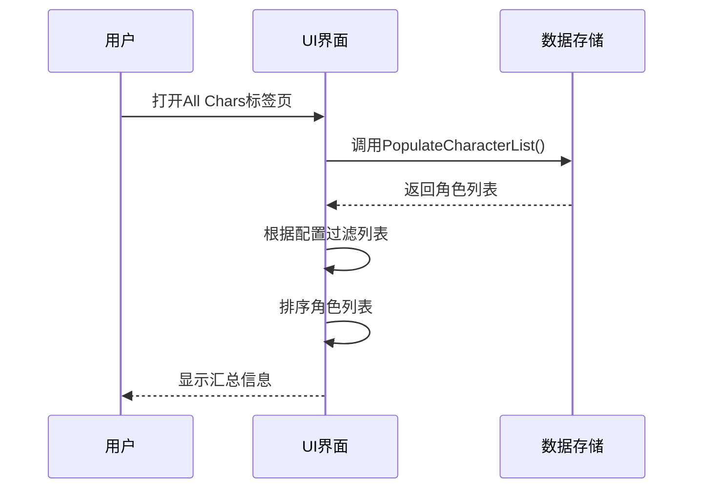
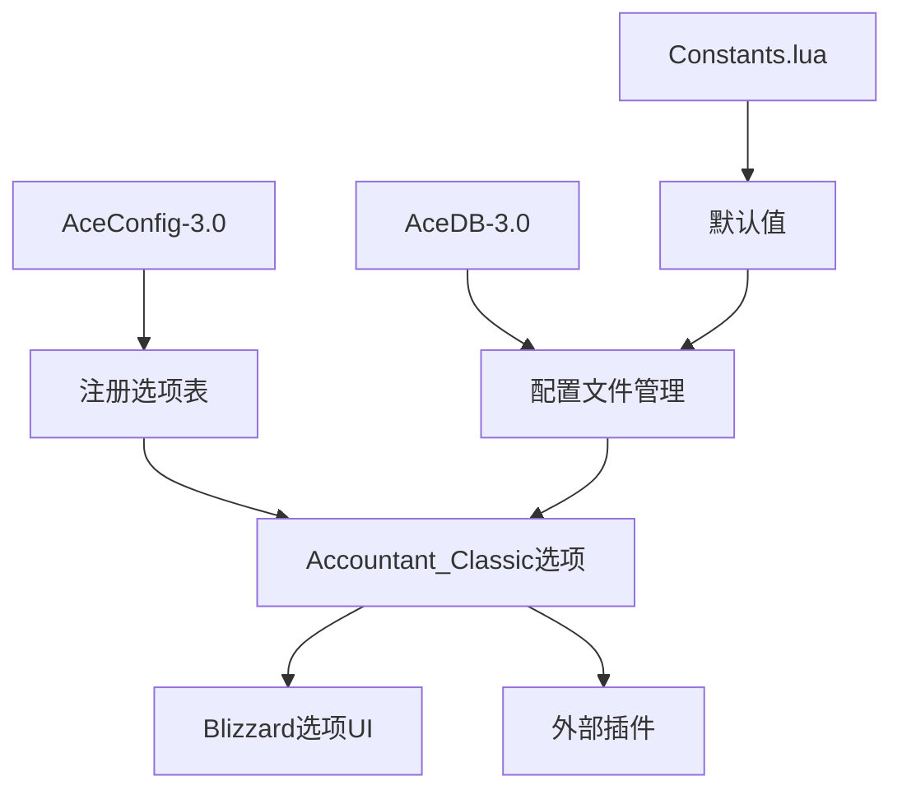

# 金币跟踪模块

<cite>
**本文档引用文件**   
- [Core.lua](file://Core/Core.lua)
- [Constants.lua](file://Core/Constants.lua)
- [MoneyFrame.lua](file://Core/MoneyFrame.lua)
- [Config.lua](file://Core/Config.lua)
</cite>

## 目录
1. [介绍](#介绍)
2. [核心功能实现](#核心功能实现)
3. [数据组织与时间窗口](#数据组织与时间窗口)
4. [主窗口布局与UI展示](#主窗口布局与ui展示)
5. [跨角色与跨服务器数据汇总](#跨角色与跨服务器数据汇总)
6. [配置系统与选项暴露](#配置系统与选项暴露)
7. [用户视角功能说明](#用户视角功能说明)
8. [开发者视角扩展方法](#开发者视角扩展方法)

## 介绍
金币跟踪模块是Accountant_Classic插件的核心功能，用于追踪玩家在游戏中的金币收支情况。该模块通过监听游戏事件来识别交易上下文，并计算金币变动归属。本文档将深入解析其内部实现机制，涵盖事件处理、数据组织、UI展示和配置系统等方面。

## 核心功能实现

金币跟踪模块通过监听PLAYER_MONEY、MERCHANT_SHOW等游戏事件来识别交易上下文。当玩家与商人交互时，MERCHANT_SHOW事件触发，模块将AC_LOGTYPE设置为"MERCH"。当玩家修理装备时，MERCHANT_UPDATE事件结合InRepairMode()检测，将AC_LOGTYPE设置为"REPAIRS"。

模块使用AC_LOGTYPE变量存储当前交易类型，在PLAYER_MONEY事件触发时读取该值以确定金币变动的分类。如果AC_LOGTYPE为空，则默认归类为"OTHER"。这种设计使得模块能够准确识别不同类型的交易并进行分类统计。

**图表来源**
- [Core.lua](file://Core/Core.lua#L1321-L1520)

**章节来源**
- [Core.lua](file://Core/Core.lua#L1321-L1520)
- [Constants.lua](file://Core/Constants.lua#L0-L260)

## 数据组织与时间窗口

模块采用多时间窗口的数据组织逻辑，包括会话、今日、本周等时间段。这些时间窗口定义在Constants.lua文件的constants.logmodes数组中，包含"Session"、"Day"、"PrvDay"、"Week"、"PrvWeek"、"Month"、"PrvMonth"、"Year"、"PrvYear"和"Total"。

数据存储结构分为两个层次：Accountant_ClassicSaveData用于存储角色的总体数据，Accountant_ClassicZoneDB用于存储按区域划分的详细数据。每个时间窗口都有独立的"In"和"Out"计数器，分别记录收入和支出。

当金币变动发生时，updateLog()函数会根据当前AC_LOGTYPE和时间窗口更新相应的计数器。对于收入（diff > 0），遍历所有非"Prv"前缀的时间窗口，增加对应分类的"In"计数；对于支出（diff < 0），增加"Out"计数。

**图表来源**
- [Constants.lua](file://Core/Constants.lua#L0-L260)
- [Core.lua](file://Core/Core.lua#L1122-L1321)

**章节来源**
- [Constants.lua](file://Core/Constants.lua#L0-L260)
- [Core.lua](file://Core/Core.lua#L1122-L1321)

## 主窗口布局与UI展示

主窗口MoneyFrame的布局结构由XML模板定义，并通过Lua代码进行动态调整。窗口包含多个标签页，每个标签页对应一个时间窗口，标签文本由Constants.lua中的tabText数组提供。

窗口布局包括以下几个主要组件：
- 标题栏：显示"Accountant Classic"
- 标签页：使用AccountantClassicTabButtonMixin进行管理
- 数据表格：显示各类交易的收支情况
- 滚动条：用于浏览多个角色的数据
- 下拉菜单：用于选择服务器、阵营和角色

MoneyFrame的布局通过arrangeAccountantClassicFrame()函数进行调整，该函数读取配置文件中的AcFramePoint设置来确定窗口位置和缩放比例。标签页的布局根据客户端版本（经典版或零售版）进行适配。

**图表来源**
- [Core.lua](file://Core/Core.lua#L0-L199)
- [Core.xml](file://Core/Core.xml)

**章节来源**
- [Core.lua](file://Core/Core.lua#L0-L199)

## 跨角色与跨服务器数据汇总

模块通过Accountant_ClassicSaveData全局表存储所有角色的数据，实现跨角色和跨服务器的数据汇总。每个角色的数据存储在Accountant_ClassicSaveData[server][player]路径下，其中server是服务器名称，player是角色名称。

跨角色数据汇总功能通过PopulateCharacterList()函数实现，该函数遍历Accountant_ClassicSaveData中的所有数据，根据用户选择的服务器和阵营过滤角色列表。All Chars标签页显示所有角色的汇总信息，包括总金币数和最后更新时间。

跨服务器功能由配置选项cross_server控制，当该选项启用时，下拉菜单会显示"All Servers"选项，允许用户查看所有服务器上角色的数据。类似地，show_allFactions选项控制是否显示所有阵营的角色数据。

**图表来源**
- [Core.lua](file://Core/Core.lua#L0-L199)

**章节来源**
- [Core.lua](file://Core/Core.lua#L0-L199)

## 配置系统与选项暴露

配置系统通过AceConfig-3.0框架暴露选项，允许用户自定义插件行为。配置选项存储在AceDB-3.0数据库中，支持配置文件功能。

主要配置选项包括：
- 显示设置：控制是否在屏幕上显示金币信息
- 区域细分：启用或禁用按区域跟踪金币交易
- UI缩放：调整主窗口和浮动信息的缩放比例
- 透明度：设置主窗口和浮动信息的透明度
- 数据显示格式：选择日期格式和数字分组方式

配置选项通过Config.lua中的getOptions()函数定义，该函数返回一个符合AceConfig规范的选项表。选项表包含多个分组，如"General"、"Minimap Button Settings"、"LDB Display Settings"等，每个分组包含相关的配置项。

**图表来源**
- [Config.lua](file://Core/Config.lua#L0-L430)

**章节来源**
- [Config.lua](file://Core/Config.lua#L0-L430)

## 用户视角功能说明

从用户视角来看，金币跟踪模块提供了直观的金币收支统计功能。玩家可以通过以下方式与模块交互：

1. 打开主窗口：输入/accountant或点击小地图按钮
2. 切换时间窗口：点击不同的标签页查看会话、今日、本周等时间段的统计
3. 查看详细信息：鼠标悬停在交易类型上查看具体交易记录
4. 调整设置：通过游戏选项界面配置插件行为
5. 移动窗口：左键拖动主窗口或浮动金币框到合适位置
6. 快速访问：右键点击浮动金币框快速打开主窗口

模块还提供了浮动金币框功能，可以在屏幕任意位置显示当前金币数量。该功能由MoneyFrame模块实现，支持在战斗中锁定位置以防止误操作。

## 开发者视角扩展方法

从开发者视角来看，金币跟踪模块的设计具有良好的扩展性。可以通过以下方式扩展模块功能：

1. 添加新的交易类型：在Constants.lua的logtypes数组中添加新的分类，并在Core.lua的事件处理函数中添加相应的事件监听
2. 扩展时间窗口：修改constants.logmodes数组以添加新的时间窗口
3. 自定义UI布局：修改XML模板文件以调整窗口布局
4. 集成外部数据：通过AceDB-3.0 API与其他插件共享数据
5. 添加新的配置选项：在Config.lua的选项表中添加新的配置项

模块采用事件驱动架构，使得新功能的添加不会影响现有代码的稳定性。通过Ace3框架提供的模块化设计，可以轻松地将新功能作为独立模块集成到主插件中。