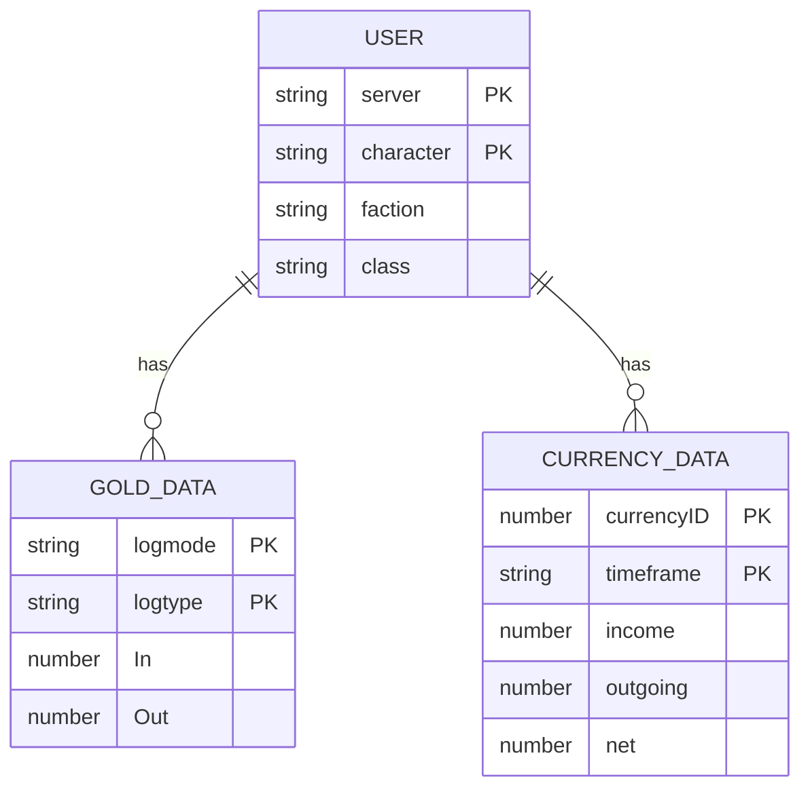

# 项目概述

<cite>
**本文档中引用的文件**   
- [README.md](file://README.md)
- [ROADMAP.md](file://Docs/ROADMAP.md)
- [Core.lua](file://Core/Core.lua)
- [Constants.lua](file://Core/Constants.lua)
- [CurrencyCore.lua](file://CurrencyTracker/CurrencyCore.lua)
- [CurrencyDataManager.lua](file://CurrencyTracker/CurrencyDataManager.lua)
- [CurrencyEventHandler.lua](file://CurrencyTracker/CurrencyEventHandler.lua)
- [CurrencyStorage.lua](file://CurrencyTracker/CurrencyStorage.lua)
- [CurrencyConstants.lua](file://CurrencyTracker/CurrencyConstants.lua)
</cite>

## 目录
1. [引言](#引言)
2. [核心目标与设计哲学](#核心目标与设计哲学)
3. [主要功能详解](#主要功能详解)
4. [项目架构层次](#项目架构层次)
5. [技术背景与实现机制](#技术背景与实现机制)
6. [适用场景与兼容性](#适用场景与兼容性)
7. [使用示例](#使用示例)
8. [未来规划](#未来规划)
9. [结论](#结论)

## 引言
Accountant_Classic 是一款专为《魔兽世界》经典版（World of Warcraft Classic）设计的轻量级插件，旨在为玩家提供精确的金币与货币跟踪功能。该插件通过监听游戏内事件，实时记录玩家在不同情境下的金币收支情况，并将其分类汇总，帮助玩家清晰地了解自己的财务状况。无论是日常任务、副本挑战还是拍卖行交易，Accountant_Classic 都能提供详尽的数据支持，使玩家能够更好地管理游戏内的经济活动。

**Section sources**
- [README.md](file://README.md#L1-L119)

## 核心目标与设计哲学
Accountant_Classic 的核心目标是为《魔兽世界》经典版玩家提供一个简单、高效且可靠的金币与货币跟踪工具。其设计哲学强调轻量化、易用性和准确性。插件通过监听游戏内的各种事件（如 `MERCHANT_SHOW`、`TAXIMAP_OPENED` 等），确定当前的“上下文”（即分类），并在每次余额变化时计算差额并归类。这种设计确保了数据的实时性和准确性，同时避免了对游戏性能的过度影响。

此外，插件还采用了“基线初始化”（baseline priming）机制，以防止首次会话时将初始余额误认为收入。这一机制在首次观察到金钱变化时设置会话基线，从而避免了初始假收入的问题，同时保留了后续的所有变化记录。这不仅提高了数据的准确性，也提升了用户体验。

**Section sources**
- [README.md](file://README.md#L120-L129)
- [Core.lua](file://Core/Core.lua#L1-L2335)

## 主要功能详解
Accountant_Classic 提供了多种功能，涵盖了金币来源分类、时间窗口统计、跨角色数据聚合等。具体功能如下：

- **金币来源分类**：插件能够根据不同的游戏事件，将金币的收支归类为多个类别，包括商人、修理、出租车、训练师、拍卖行、邮件、任务、拾取等。每个类别的收支情况都会被详细记录，方便玩家进行分析。
- **时间窗口统计**：插件支持多种时间窗口的统计，包括会话、今日、本周、本月、本年以及它们的前一周期，还有总计。玩家可以根据需要选择不同的时间窗口，查看相应的统计数据。
- **跨角色数据聚合**：插件提供了“所有角色”标签页，可以跨服务器、跨阵营地查看所有角色的金币情况。该功能支持排序，帮助玩家快速找到特定角色的财务信息。
- **最小化地图按钮与LDB面板**：插件集成了最小化地图按钮和LDB（LibDataBroker）面板，玩家可以通过点击这些按钮或面板快速访问数据。此外，还可以通过右键菜单或界面选项进行设置。
- **区域级细分**：可选的区域级细分功能允许玩家查看在不同区域的金币赚取和花费情况，进一步细化财务分析。
- **多语言支持**：插件支持多种语言，确保全球玩家都能方便地使用。

**Section sources**
- [README.md](file://README.md#L130-L145)

## 项目架构层次
Accountant_Classic 的项目架构分为两个主要模块：Core 模块和 CurrencyTracker 模块。这两个模块各司其职，共同构成了插件的核心功能。

### Core 模块
Core 模块负责处理金币的跟踪和基本功能。它包含以下文件：
- **Config.lua**：配置文件，用于存储用户的设置。
- **Constants.lua**：常量文件，定义了各种事件和分类的常量。
- **Core-Classic.xml** 和 **Core.xml**：XML 文件，定义了插件的用户界面。
- **Core.lua**：主逻辑文件，实现了金币跟踪的核心功能。
- **MoneyFrame.lua**：处理金币信息显示的模块。
- **Template-Classic.xml** 和 **Template.xml**：模板文件，用于构建用户界面。

### CurrencyTracker 模块
CurrencyTracker 模块负责跟踪所有游戏内的货币（不仅仅是金币）。它包含以下文件：
- **CurrencyConstants.lua**：定义了支持的货币及其元数据。
- **CurrencyCore.lua**：主控模块，协调其他子模块的工作。
- **CurrencyDataManager.lua**：数据管理模块，负责处理货币数据的读取和写入。
- **CurrencyEventHandler.lua**：事件处理模块，监听游戏内的货币相关事件。
- **CurrencyFrame.lua** 和 **CurrencyFrame.xml**：用户界面模块，提供货币跟踪的UI。
- **CurrencyStorage.lua**：存储模块，负责持久化货币数据。

**Section sources**
- [README.md](file://README.md#L146-L155)
- [Core/Constants.lua](file://Core/Constants.lua#L1-L260)
- [CurrencyTracker/CurrencyConstants.lua](file://CurrencyTracker/CurrencyConstants.lua#L1-L554)

## 技术背景与实现机制
Accountant_Classic 依赖于 Ace3 框架和 LibDataBroker 等第三方库，以实现高效的功能扩展和用户界面集成。

### 事件驱动机制
插件通过监听游戏内的各种事件来确定当前的“上下文”。例如，当 `MERCHANT_SHOW` 事件触发时，插件将当前分类设置为 `MERCH`；当 `TAXIMAP_OPENED` 事件触发时，插件将当前分类设置为 `TAXI`。这些事件的监听和处理由 `Constants.lua` 文件中的常量列表定义，并在 `Core.lua` 文件中实现。

### SavedVariables 持久化策略
插件使用 `SavedVariables` 来持久化数据。金币数据保存在 `Accountant_ClassicSaveData` 中，按服务器和角色组织。货币数据则保存在 `Accountant_Classic_CurrencyDB` 中，同样按服务器和角色组织。这种结构确保了数据的安全性和可访问性。

**Diagram sources**
- [Core.lua](file://Core/Core.lua#L1-L2335)
- [CurrencyStorage.lua](file://CurrencyTracker/CurrencyStorage.lua#L1-L1222)

**Section sources**
- [README.md](file://README.md#L156-L165)
- [Core.lua](file://Core/Core.lua#L1-L2335)
- [CurrencyStorage.lua](file://CurrencyTracker/CurrencyStorage.lua#L1-L1222)

## 适用场景与兼容性
Accountant_Classic 适用于《魔兽世界》经典版、赛季分支和零售版（功能覆盖因客户端而异）。插件兼容 Lua 5.1 运行时环境，并基于 ACE3 框架开发。由于其轻量化的设计，插件在各种客户端上都能稳定运行，不会对游戏性能造成显著影响。

插件的适用场景广泛，包括但不限于：
- **日常任务**：跟踪每日任务的金币收益。
- **副本挑战**：记录副本中的金币花费和奖励。
- **拍卖行交易**：监控拍卖行的买卖情况。
- **角色管理**：跨角色查看和管理金币情况。

**Section sources**
- [README.md](file://README.md#L166-L175)

## 使用示例
玩家可以通过多种方式访问 Accountant_Classic 的数据。以下是几种常见的使用示例：

- **打开主窗口**：
  - 使用斜杠命令 `/accountant` 或 `/acc`。
  - 左键点击最小化地图按钮或 LDB 面板。
- **选项设置**：
  - 右键点击最小化地图按钮或 LDB 面板。
  - 在游戏界面选项中进行设置。
- **切换时间窗口**：
  - 在主窗口底部的标签页中切换不同的时间窗口（会话、今日、本周等）。
- **查看数据**：
  - 头部显示总金额，网格显示按来源分类的收支情况。

**Section sources**
- [README.md](file://README.md#L176-L185)

## 未来规划
根据 `ROADMAP.md` 文件中的规划，Accountant_Classic 的未来发展计划包括：

- **短期目标**：
  - 跟踪所有游戏内的货币（不仅仅是金币），记录每种货币的收支情况。
  - 提供用户界面优化和可访问性改进，如键盘导航、更大字体选项、框架缩放预设等。
  - 增加选项，如基线初始化的聊天消息开关、设置和保存数据的导出/导入功能。
- **中期目标**：
  - 增强分类逻辑，提供更细粒度的来源分类（如地下城、团队副本、世界任务等）。
  - 提供历史数据分析，如每周/每月净变化的趋势图、选定范围内的收入/支出前五名列表。
  - 数据维护功能，如归档旧数据、数据完整性检查和自我修复提示。
- **长期目标**：
  - 为其他插件提供 API 接口，允许查询 Accountant_Classic 的总计和差额。
  - 支持多配置文件，允许每个账户有多个命名配置并快速切换。
  - 改进本地化，保持所有新 UI/消息的完全本地化。

**Section sources**
- [ROADMAP.md](file://Docs/ROADMAP.md#L1-L46)

## 结论
Accountant_Classic 是一款功能强大且易于使用的《魔兽世界》经典版金币与货币跟踪插件。通过其轻量化的设计、准确的事件驱动机制和灵活的用户界面，插件为玩家提供了全面的财务数据分析工具。无论是日常任务、副本挑战还是拍卖行交易，Accountant_Classic 都能帮助玩家更好地管理游戏内的经济活动。随着未来规划的逐步实现，插件的功能将进一步增强，为玩家带来更加丰富的体验。