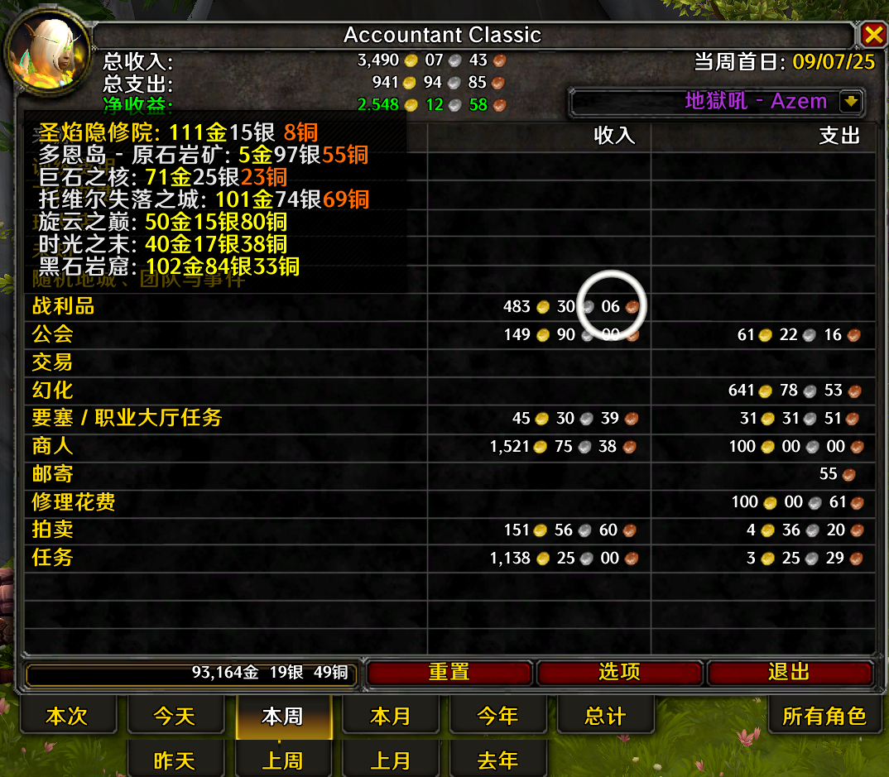
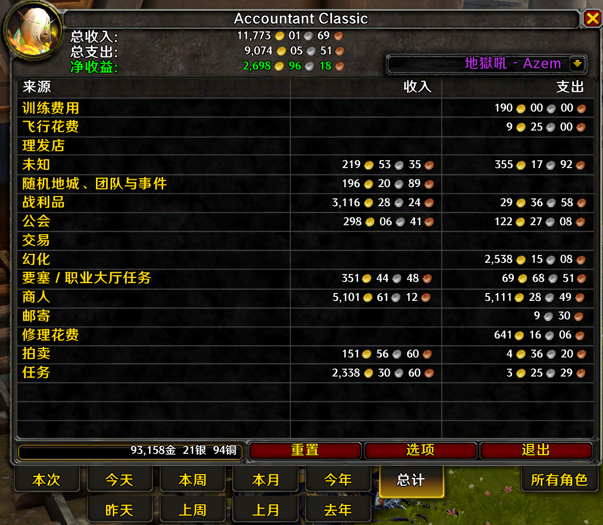
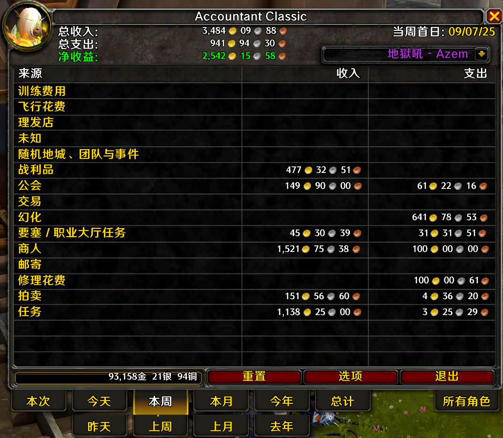

# Accountant Classic

A lightweight World of Warcraft addon that tracks your incoming and outgoing gold by source across multiple time ranges (Session, Day, Week, Month, Year, Total). It provides a clear breakdown table, character summaries, and quality-of-life features.

- Addon folder: `Accountant_Classic/`
- Core code: `Core/`
- In-game textures: `Images/`
- Documentation and screenshots: `Docs/`

## Features

- Money tracking by source: Merchant, Repairs, Taxi, Trainer, Auction House, Mail, Quest, Loot, and more.
- Time windows: Session, Today, This Week, This Month, This Year, and their previous periods, plus Total.
- All Characters tab: cross-realm, cross-faction overview with sorting.
- Minimap/LDB button with configurable display.
- Zone-level breakdown (optional) for where the money was earned/spent.
- Localization support.

## How it works (high-level)

- The addon listens to WoW UI events to determine the current "context" (category). For example, `MERCHANT_SHOW` sets the category to `MERCH`, `TAXIMAP_OPENED` sets `TAXI`, etc. See `Core/Constants.lua` for the full list.
- On every balance change (`PLAYER_MONEY`), it computes the delta and attributes it to the current context. See `updateLog()` in `Core/Core.lua`.
- Group/party shared loot uses `CHAT_MSG_MONEY` to parse the exact amount and force a single categorized update while preventing double counting. See `AccountantClassic_OnShareMoney()` in `Core/Core.lua`.
- The UI table is rendered by `AccountantClassic_OnShow()` in `Core/Core.lua`, which reads the saved totals and formats the rows/columns.

### Baseline priming (first session safety)

To avoid counting your initial balance as income on a fresh profile/session, a one-time baseline priming is performed the first time we observe money (via `PLAYER_MONEY` or `CHAT_MSG_MONEY`). This sets the session baseline and then normal logging proceeds. A one-time colored chat message confirms priming.

## Installation

1. Close the WoW client.
2. Copy the `Accountant_Classic` folder into your WoW AddOns directory:
   - Retail: `_retail_/Interface/AddOns/`
   - Classic Era/Hardcore/SoD: `_classic_/Interface/AddOns/`
   - Wrath Classic / Cata Classic: `_classic_*/Interface/AddOns/`
3. Launch the game and enable the addon on the character selection screen.

## Usage

- Open the main window:
  - Slash command: `/accountant` or `/acc`
  - Left-click the minimap/Databroker button
- Options:
  - Right-click the minimap/Databroker button, or use the Interface Options.
- Tabs at the bottom switch the time window (Session, Today, This Week, etc.).
- The header shows totals; the grid shows money In/Out by source.

## Screenshots

The project includes both UI textures (for in-game frames/buttons) and real screenshots. For README purposes, the screenshots below are more illustrative; textures are shown separately.

### Real screenshots (Docs/screenshots/)

- This Week — Source Breakdown  
  

- Totals  
  

- This Week — Totals  
  

### In-game textures (Images/)

These are addon art assets (BLP). Shown here for completeness.

- Button Up  
  `Images/AccountantClassicButton-Up.blp`

- Button Down  
  `Images/AccountantClassicButton-Down.blp`

- Frame Left  
  `Images/AccountantClassicFrame-Left.blp`

- Frame Right  
  `Images/AccountantClassicFrame-Right.blp`

> Note: GitHub may not preview BLP files. They are referenced by the addon in-game.

## Data & SavedVariables

- Character data is saved under `Accountant_ClassicSaveData` (per realm/character) and `Accountant_ClassicZoneDB` (optional zone breakdown).
- Money is summed into `In` and `Out` buckets per source and per time window.

## Compatibility

- WoW Classic/Seasonal branches and Retail (feature coverage varies by client).
- Lua 5.1 runtime, ACE3-based addon framework.

## Localization

- Locales live under `Locale/`.
- Contributions for language updates are welcome.

## Contributing

- Pull requests welcome for bug fixes, UI improvements, and localizations.
- Please do not commit third-party libraries; they live under `Libs/`.

## Roadmap

Planned features and ideas (including tracking all in-game currencies beyond gold) are documented in the project roadmap:

- See `Docs/ROADMAP.md` for details.

## Credits

- Original Author(s): Sabaki, Shadow, Rophy
- Maintainers/Updates: Arith, kamusis
- Thanks: Testers and community contributors

## Changelog (excerpt)

- See the header of `Core/Core.lua` for a historical changelog. Notable recent changes:
  - Priming Approach (one-time baseline) to avoid first-session skew
  - Guarded `CHAT_MSG_MONEY` priming & one-time chat alert
  - Minor lint hardening and inline documentation
